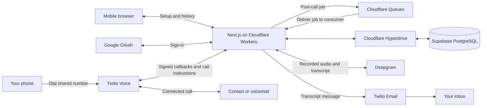

# Bat Phone

Call one number, say a contact's name or enter a speed dial, and receive the recorded conversation as a transcript in your inbox.

**Live demo: [batphone.sanjeevnandam.com](https://batphone.sanjeevnandam.com)** - sign in with a Gmail account, verify your mobile number, and add your first contact. No developer accounts or API keys are needed to try the hosted app.

The browser handles setup and call history; conversations use your ordinary phone dialler. The recipient needs neither an account nor an app.

## Choose how to use it

| Goal                            | Start here                                                                                                             |
| ------------------------------- | ---------------------------------------------------------------------------------------------------------------------- |
| Try the configured solution     | [Live demo](https://batphone.sanjeevnandam.com): Gmail sign-in → phone verification → first contact → home             |
| Run and inspect the code        | [Codespaces steps below](#run-in-github-codespaces) or [run locally](#run-locally), with your own provider credentials |
| Deploy your own hosted instance | [Cloudflare and Supabase deployment](docs/DEPLOYMENT.md), including permissions, database, and domain setup            |
| Verify the whole workflow       | [Manual end-to-end checklist](docs/MANUAL_E2E.md)                                                                      |

## Watch the overview

An 82-second walkthrough of setup, calling, recording, and transcript delivery.

<table>
<tr><td width="360">

https://github.com/user-attachments/assets/c6010141-37da-4db6-a330-49439d62e352

</td></tr>
</table>

## How it works

1. **Prepare once:** sign in with an allowed Google account, confirm your first and last name (prefilled from Google when available), verify your mobile number by SMS, then add your first contact with a name, phone number, and speed-dial code. Onboarding opens the home screen only after that contact is saved.
2. **Call:** dial Bat Phone from that verified number. Say a contact's name or enter their code followed by `#`. Confirm the selection by voice or keypad.
3. **Talk:** Twilio connects the call and records from when the recipient **or their voicemail answers**. This includes voicemail greetings and messages you leave; it does not record outbound ringing.
4. **Review:** after the call, open the emailed transcript or use call history to read it and play the recording. Processing failures expose recovery actions in call detail.

Each user has their own contacts and call history, even though everyone calls the same Bat Phone number. A verified mobile number can belong to only one account.

Mechanically, Twilio owns the phone call and asks the app what to do at each step over signed webhooks. The app looks up the caller by number and answers with TwiML. When the call ends, Twilio's status and recording callbacks start the post-call pipeline: fetch the audio, transcribe it, email the transcript.

The hosted deployment connects these services:



In a Node.js run (Codespaces or your own machine), a single Node process and a plain PostgreSQL database replace the hosted runtime and database connection, and `after()` replaces queue delivery. Google, Twilio, and Deepgram perform the same roles. [Detailed architecture](docs/ARCHITECTURE.md).

## Technical architecture

- **One application:** Next.js, React, and TypeScript serve the mobile web interface, authenticated actions, and Twilio webhook endpoints in a shared application, running on Node.js (Codespaces or your own machine) or through OpenNext on Cloudflare Workers.
- **Identity:** Better Auth handles Google sign-in. Twilio Verify confirms the user's mobile number so incoming calls can be matched to their personal contacts.
- **Calling:** Twilio Voice answers the shared Bat Phone number, collects a spoken name or keypad code, and connects the confirmed contact. Contact matching runs in the app.
- **Storage:** PostgreSQL stores users, contacts, calls, transcripts, and processing state. Node.js runs use your own PostgreSQL or the one bundled in the Codespaces devcontainer; the hosted demo uses Supabase PostgreSQL through Cloudflare Hyperdrive. Drizzle migrations define the same schema everywhere. Audio stays at Twilio behind authenticated playback.
- **After the call:** Cloudflare Queues delivers recording jobs to the Worker. Deepgram transcribes the audio; Twilio Email sends the transcript and call-page link. Node.js runs execute these same processing steps through Next.js `after()` instead of a queue.
- **Runtime:** The Codespaces devcontainer supplies Node.js 22 and PostgreSQL 16. A Node.js run must stay up during calls and processing. The hosted path uses Workers, Supabase PostgreSQL through Hyperdrive, and Queues for post-call processing.

The [architecture guide](docs/ARCHITECTURE.md) explains the data model, state transitions, security boundaries, recovery, and scaling options. The [decision record](docs/DECISIONS.md) explains why this design was chosen.

## Services you need before running it

These are the dependencies for **running your own environment**. The live demo already has them configured. Local development means a Node.js process on your own machine or in GitHub Codespaces; hosting means the Cloudflare deployment.

| Dependency                    | Role                                     | Local development (your machine or Codespaces)                           | Hosted deployment                                                      |
| ----------------------------- | ---------------------------------------- | ------------------------------------------------------------------------ | ---------------------------------------------------------------------- |
| Google Cloud / Better Auth    | Google sign-in and app sessions          | OAuth client with the localhost or Codespaces redirect URL               | Same client, deployed redirect URL                                     |
| Twilio Voice and Verify       | Calls, recordings, and SMS verification  | Account credentials, Voice number, Verify service                        | Same services; callbacks point to the hosted app                       |
| Twilio Email                  | Transcript emails                        | Authenticated sender domain and Twilio API key                           | Same integration                                                       |
| Deepgram                      | Batch speech-to-text                     | Project API key                                                          | Same integration                                                       |
| PostgreSQL / Drizzle          | Persistent data and committed migrations | Your own PostgreSQL 16, or the one bundled in the devcontainer           | Supabase PostgreSQL; Supabase Auth is not used                         |
| Public HTTPS URL              | Lets Twilio reach the webhooks           | A tunnel such as ngrok on your machine; the forwarded port in Codespaces | The Worker's custom domain                                             |
| Cloudflare Workers / OpenNext | Next.js hosting                          | Not required; Node.js runs the app                                       | Workers Paid and the OpenNext adapter                                  |
| Cloudflare Hyperdrive         | PostgreSQL connection pooling            | Not required                                                             | Connects Workers to Supabase with verified TLS; query caching disabled |
| Cloudflare Queues             | Durable post-call job delivery           | Not required; Next.js `after()` runs jobs in-process                     | Job queue, consumer, and failed-job queue                              |

You also need Node.js 22 when running on your own machine, a mobile phone to call from, and a second number to answer during the test. The [setup guide](docs/SETUP.md#credential-setup) walks through each provider; its [secret checklist](docs/SETUP.md#codespaces-secrets) gives every required variable, where to obtain it, and where to save it. Existing accounts can be reused when you control their configuration.

## Run in GitHub Codespaces

For a new setup, follow this order. **Complete steps 1 and 2 before creating the Codespace.**

1. **Prepare provider accounts.** Follow [credential setup](docs/SETUP.md#credential-setup) to create the Google OAuth client, configure Twilio Voice/Verify/Email, and obtain the Deepgram key. Generate the app's auth secret and choose the Google email allowed to sign in.
2. **Save the required secrets.** Use the exact names in [Codespaces secrets](docs/SETUP.md#codespaces-secrets). Save them under repository **Settings → Secrets and variables → Codespaces**, not Actions. If you cannot manage repository secrets, use personal Codespaces secrets with access granted to your repository, as described in that guide. A fork does not inherit upstream secrets.
3. **Create the Codespace.** On `main`, choose **Code → Codespaces → Create codespace on main**. Accept the workspace-trust prompt for this repository if shown, and wait for dependency installation and migrations.
4. **Register this environment with Google.** In the terminal, run:

   ```bash
   source scripts/codespace-env.sh
   printf '%s\n' "$PUBLIC_BASE_URL"
   ```

   In the Google OAuth client from step 1, add that exact URL as an **Authorized JavaScript origin**, and the URL plus `/api/auth/callback/google` as an **Authorized redirect URI**. Keep other environments' entries. See [Google redirect setup](docs/GOOGLE_AUTH.md#redirect-uris).

5. **Start and expose the app.** Run `npm run dev` from that same terminal and keep it running. Set port **3000 → Port Visibility → Public** in the Ports panel. Check startup and database readiness using the [detailed quick start](docs/SETUP.md#quick-start-in-github-codespaces); it also explains missing-secret errors and Twilio configuration failures.
6. **Test the real journey.** Open the forwarded HTTPS URL on your phone. Sign in, confirm your name, complete phone verification and the first-contact step, then follow the [first real call checklist](docs/MANUAL_E2E.md#make-the-first-real-call) through recording playback and actual inbox delivery.

Database and public URL settings are supplied automatically. Do not copy a localhost `.env.local` into Codespaces. If you change secrets after creation, stop and reopen the Codespace so it receives them.

Stopping and reopening the same Codespace preserves its PostgreSQL volume. A new Codespace starts with a new database; deleting the Codespace loses its data, and a full rebuild can clear Docker volumes. Keep it running during calls and processing. Configuring the same Twilio number for another environment repoints its callbacks, so use one active calling environment at a time.

## Run locally

Requires Node.js 22+, PostgreSQL 16, and the provider credentials described in [setup](docs/SETUP.md#credential-setup).

```bash
npm ci
cp .env.example .env.local
# Fill in .env.local and create the database before continuing.
npm run db:migrate
npm run dev
```

- **Database:** create it first, following [database setup](docs/DB_SETUP.md). Migrations are committed; `db:migrate` applies them.
- **Web pages and sign-in** work on `http://localhost:3000`. Keep `BETTER_AUTH_URL` there and register that origin with Google, as described in [Google sign-in](docs/GOOGLE_AUTH.md).
- **Real calls** need Twilio to reach the app. Set `PUBLIC_BASE_URL` to a public HTTPS tunnel URL and run `npm run twilio:configure` after every change, as described in [local development](docs/SETUP.md#running-outside-codespaces).

`npm run dev` pins port 3000 because the OAuth redirect URIs are registered for it. [`.env.example`](.env.example) documents all environment variables. Never commit credentials.

## Hosted demo deployment

The [live demo](https://batphone.sanjeevnandam.com) runs on Cloudflare Workers Paid with Supabase PostgreSQL, Hyperdrive, and Queues. It accepts Gmail accounts and uses the same code and migrations as the Node.js runs.

To deploy your own instance, follow [the deployment guide](docs/DEPLOYMENT.md). It starts with the Workers plan, [account-token permissions](docs/DEPLOYMENT.md#cloudflare-account-api-token-setup), and Supabase setup, then covers the build, secrets, OAuth URLs, and Twilio callbacks. Replace the checked-in deployment's domain and resource IDs with your own. Workers Free is insufficient for this app's authenticated rendering and can return Error 1102.

## Development

| Command                                  | Purpose                                                  |
| ---------------------------------------- | -------------------------------------------------------- |
| `npm run dev`                            | Development server on port 3000                          |
| `npm run build` / `npm run start`        | Production build / server                                |
| `npm run lint`                           | ESLint                                                   |
| `npm run type-check`                     | TypeScript checks                                        |
| `npm test`                               | Unit, component, and contract tests                      |
| `npm run db:generate`                    | Generate a migration after a schema change               |
| `npm run db:migrate`                     | Apply committed migrations                               |
| `npm run twilio:configure`               | Set Twilio callbacks and create/reuse Verify service     |
| `npm run cf:build` / `npm run cf:deploy` | Build or deploy the hosted Worker with credential checks |

Every script, including database reset, seeding, Drizzle Studio, the resolution report, and the Worker preview, is listed under [setup scripts](docs/SETUP.md#scripts). Commit schema changes with their generated migrations. Use `db:push` only for throwaway local databases. Seed data belongs to `SEED_EMAIL`; it is visible only when that account signs in.

## Design and implementation

The [original plan](docs/plans/2026-09-11-001-feat-bat-phone-plan.md) organized the product requirements into acceptance examples, dependencies, and implementation units. Public webhook access, provider configuration, caller ownership, and callback ordering were treated as design risks alongside the happy path.

The main design choices focused on a simple deployment, reliable call handling, and recoverable post-call processing:

| Need                                    | Choice and reasoning                                                          | Tradeoff                                                                        |
| --------------------------------------- | ----------------------------------------------------------------------------- | ------------------------------------------------------------------------------- |
| Select a saved contact                  | Twilio Gather plus a deterministic matcher, confirmation, and keypad fallback | Speech can still be ambiguous; no open-ended voice assistant                    |
| Deliver a transcript after a call       | Batch Deepgram transcription using the recording's two channels               | Transcript is available after processing, not live                              |
| Keep setup manageable                   | A shared Next.js application; Twilio for Voice, Verify, and Email             | Application availability and provider configuration matter throughout the flow  |
| Survive restarts and repeated callbacks | PostgreSQL constraints, persisted states, and guarded processing claims       | External sends are not an exactly-once transaction                              |
| Finish work after webhook responses     | Next.js `after()` in Node.js runs; durable Queues on Cloudflare               | An interrupted Node.js run may need retry; uncertain email sends require review |

A separate hosted demo made the solution available without starting a Codespace. That introduced OpenNext for the Workers runtime, Supabase for persistent PostgreSQL, Hyperdrive for database connections, and Queues for post-call jobs that can outlive an HTTP response. The development environment remains independently runnable.

Review then shaped the details: compact call history replaced repetitive availability badges, speed-dial suggestions became bounded with custom entry, and recovery was extended for interrupted email processing and late recordings.

Read [why these choices were made](docs/DECISIONS.md) for alternatives considered, implementation evidence, and remaining limits. The original plan is preserved as a historical record; current behavior and setup live in the architecture and setup guides. Planned checks are not presented as completed tests.

## Verification and evidence

Automated tests and CI cover matching, ownership, state transitions, callback replay, recovery, and UI behaviour with provider interactions mocked; CI also applies migrations to PostgreSQL, builds the app and Docker image, probes health and readiness, and scans for secrets. They do not establish that a deployment's provider accounts or public callback URLs are configured correctly.

The [manual end-to-end checklist](docs/MANUAL_E2E.md) covers the real-call checks that automated tests cannot. The [decision record](docs/DECISIONS.md) links implementation files and tests to the reasoning.

## Repository map

```text
src/actions/          Authenticated server actions
src/app/              Pages, auth, and Twilio webhook routes
src/components/       Shared UI and navigation
src/lib/batphone/     Call flow, matching, transcription, and email
src/db/               Database schema, connection, and seed data
drizzle/              Committed database migrations
scripts/              Setup, verified Supabase migrations, and guarded Cloudflare builds
worker.ts             Hosted HTTP entry point and queue consumer
wrangler.jsonc        Cloudflare bindings, custom domain, and resource limits
open-next.config.ts   Next.js-to-Workers adapter configuration
.devcontainer/        Codespaces services and lifecycle hooks
docs/                 Architecture, setup, and verification
```

Tests are co-located with the code they cover. [AGENTS.md](AGENTS.md) links to the shared [coding conventions](docs/CLAUDE.md).

## Scope and limitations

This is a proof of concept. Caller ID is trusted after initial SMS verification; it can still be spoofed. Transcripts and phone numbers are stored in plaintext, emails contain transcripts, and recordings remain at Twilio. A Node.js run's post-call processing requires its process to stay running. Hosted queue jobs can resume interrupted work, but uncertain email sends need manual review; database changes and queue publication are not a single transaction. Removing an address from the allowlist blocks that account's next sign-in; a session already issued lasts until it expires.

See the [architecture overview](docs/ARCHITECTURE.md) for security boundaries, recovery behavior, tradeoffs, scaling, and remaining limitations.

## Documentation

| Document                                                          | Purpose                                                                                             |
| ----------------------------------------------------------------- | --------------------------------------------------------------------------------------------------- |
| [Original plan](docs/plans/2026-09-11-001-feat-bat-phone-plan.md) | Historical requirements, option analysis, sequencing, and intended checks                           |
| [Design decisions](docs/DECISIONS.md)                             | Reasoning, alternatives, implementation evolution, and evidence                                     |
| [Architecture](docs/ARCHITECTURE.md)                              | System design, tradeoffs, and demo outline                                                          |
| [Presentation diagrams](docs/batphone-presentation.excalidraw)    | Six Excalidraw frames: journey, hosted architecture, call sequence, lifecycle, environments, limits |
| [Setup and operations](docs/SETUP.md)                             | Credentials, Codespaces, and local development                                                      |
| [Hosted deployment](docs/DEPLOYMENT.md)                           | Cloudflare Workers, Supabase, Hyperdrive, Queues, and operations                                    |
| [Google sign-in](docs/GOOGLE_AUTH.md)                             | OAuth, allowlist, and sign-in troubleshooting                                                       |
| [Database setup](docs/DB_SETUP.md)                                | Migrations, seeding, and reset                                                                      |
| [Manual end-to-end check](docs/MANUAL_E2E.md)                     | Fresh Codespaces rehearsal and phone workflow checklist                                             |
| [Coding conventions](docs/CLAUDE.md)                              | Guidance for contributors and coding agents                                                         |

## License

[MIT](LICENSE).
