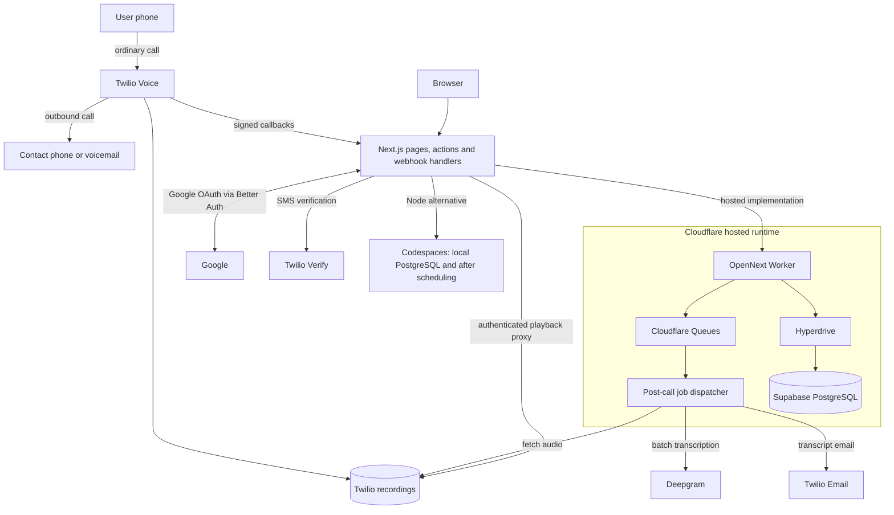
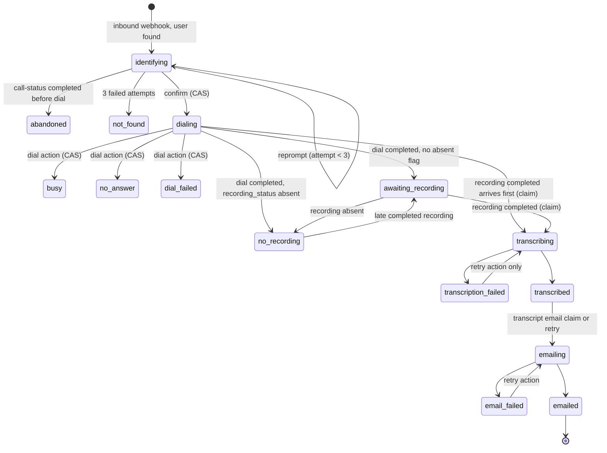

# Bat Phone architecture overview

This document describes how Bat Phone connects ordinary phone calls to recorded conversations, transcripts, and email.
It covers the system architecture, the Twilio voice integration, caller identification, contact resolution, the transcription pipeline, email delivery, the data model, the tradeoffs, how the system could scale, and the limitations of the proof of concept.
For the reasoning and alternatives behind this design, read [Design decisions](DECISIONS.md) and the [historical implementation plan](plans/2026-09-11-001-feat-bat-phone-plan.md).
The deployed Cloudflare configuration and alternative hosting options are in [DEPLOYMENT.md](DEPLOYMENT.md).
Setup and operation are in [SETUP.md](SETUP.md); the scripted manual check is in [MANUAL_E2E.md](MANUAL_E2E.md).

## Contents

1. [What the product does](#what-the-product-does)
2. [Call walkthrough](#call-walkthrough)
3. [System architecture](#system-architecture)
4. [Twilio voice integration](#twilio-voice-integration)
5. [User identification via phone number](#user-identification-via-phone-number)
6. [Contact resolution workflow](#contact-resolution-workflow)
7. [Transcription pipeline](#transcription-pipeline)
8. [Email delivery system](#email-delivery-system)
9. [Data persistence model](#data-persistence-model)
10. [Failure handling](#failure-handling)
11. [Security](#security)
12. [Tool selection](#tool-selection)
13. [Key architectural tradeoffs](#key-architectural-tradeoffs)
14. [How the system could scale](#how-the-system-could-scale)
15. [Limitations of the proof of concept](#limitations-of-the-proof-of-concept)
16. [Demo narration outline](#demo-narration-outline)

## What the product does

A user signs in with Google, confirms their first and last name, verifies their mobile number by SMS, and adds their first contact. Step 1 confirms identity and the phone; step 2 saves a contact before opening home. Google names are editable suggestions. A persisted onboarding completion timestamp allows later visits to resume the unfinished step without briefly displaying the dashboard; deleting contacts later does not restart onboarding.
They then dial one Twilio number, the bat phone, from that mobile.
The system recognises them by caller ID, asks who they want to call, resolves the spoken name or keypad speed dial against their contacts, confirms, and bridges the call to the contact with recording on.
When the call ends the recording is transcribed and the employee receives an email with the call metadata, the transcript, and a link to the call page where the recording plays.
Call history and transcripts are also available in the mobile web interface.

## Call walkthrough

The end-to-end experience in plain terms, with Mike Anderson as the example contact.

1. **The employee dials a Twilio number.**
   This is the bat phone.
   It is a real phone number that Twilio owns and that we lease monthly.
   The employee calls it from their own mobile using the normal phone dialler, the same way they would call anyone.
2. **Twilio answers and asks the app what to do.**
   When the call arrives, Twilio does not know what to say.
   It sends an HTTP request to our app with the caller's number.
   The app looks that number up, finds the employee's account, and replies with instructions: play the prompt "Hi Sanjeev. Who would you like to call?"
3. **The employee names a contact by voice or keypad.**
   They say "Mike Anderson" out loud, or they press Mike's speed-dial code on the phone keypad.
   Twilio converts the speech to text and sends it to the app.
   The app matches it against that employee's contact list and replies: "Mike Anderson. Press 1 or say yes to call, or 2 to try again."
   If the name was not understood, the app says what it heard ("I heard my canderson, and I don't have that contact. Say the name again, or press their speed dial, then pound.") and asks again, up to three times, offering only the keypad on the last try.
   Every attempt is recorded with what was heard and what the employee did next, and shown on the call's page afterwards.
4. **The outbound call is placed and recorded.**
   After the employee presses 1, the app tells Twilio to dial Mike's number and connect the two calls together.
   Mike's phone rings, showing the Twilio number as the caller.
   Twilio records the conversation from the moment Mike or his voicemail answers, including greetings and any message left, with the employee on one audio channel and Mike on the other.
5. **The call ends and the app is told.**
   When either side hangs up, Twilio sends the app a callback saying the call finished and, shortly after, another saying the recording is ready.
6. **The employee receives a transcript email.**
   The app downloads the recording, sends it to Deepgram for transcription, and emails the employee.
   The email has a header with the call metadata (who called whom, the number dialled, when it started, how long it lasted), then the transcript with each line labelled "You" or "Mike Anderson", then a link.
   The link opens the call's page in the app, where the recording can be played.

There is no phone app.
The "app" is a web server; the employee uses it through a mobile web browser before the call (sign in, verify number, manage contacts) and after it (read transcripts, play recordings).
During the call itself, the employee's phone is on an ordinary voice call and runs nothing of ours; Twilio sends the requests to the server on behalf of the phone network.
A basic phone with no internet would work the same way.
Mike is on the receiving end only: his phone rings with an ordinary call showing the bat phone number, and he has no account, never visits the site, and does not receive the transcript.

## System architecture

In Node/Codespaces, one Next.js 16 process serves the mobile web pages, the server actions behind them, the Twilio webhook handlers, and the authenticated recording proxy.
Postgres holds users, contacts, calls, the Twilio event log, and resolution attempts.
Twilio owns the number, runs the calls, and stores the recordings.
Deepgram transcribes.
Twilio Email sends the transcript.
On Node/Codespaces, post-call work uses `after()` from `next/server`. The Cloudflare deployment uses an OpenNext Worker, request-scoped Hyperdrive connections to Supabase PostgreSQL, and durable Queues. The same persisted-state dispatcher runs in both environments, and compare-and-set claims guard repeated work. Email acceptance and the database result are separate operations, so retries can still duplicate a send.



Both runtimes use the same domain logic and schema. The hosted diagram separates responsibilities, not separately deployed Next.js applications. The Worker handles both web requests and queue deliveries.

**Code layout.**
Route handlers under `src/app/api/twilio/` and server actions under `src/actions/` stay thin.
Domain logic lives in `src/lib/batphone/`: TwiML builders, the matcher, phone normalisation, the state machine, the repository with its compare-and-set claims, the pipeline, the Deepgram client, the media fetch, and the mailer.
Domain helpers are unit-tested independently of Next.js; the scheduling adapter in `after.ts` imports `next/server`.

**Runtime environment.**
The hosted demo runs on Cloudflare Workers Paid, built by OpenNext with Node compatibility enabled. `wrangler.jsonc` configures a 1,000 ms CPU budget and the custom domain. Supabase supplies PostgreSQL; it is not used for authentication or its Data API. Hyperdrive pools origin connections, with query caching disabled so sessions and workflow state stay current. Origin TLS uses `verify-full` with the Supabase CA. The application creates its database client within each request or queue invocation and closes it after the response stream completes; it does not share Worker sockets across requests.

For development, GitHub Codespaces uses a compose-based devcontainer: a Node 22 container plus Postgres 16.
Port 3000 is forwarded publicly so Twilio can reach the webhooks.
The public URL is derived from the codespace name and used for every callback URL, the signature check, Better Auth, and the Google redirect URI, so one value keeps calls and logins consistent.

## Twilio voice integration

Twilio Programmable Voice drives the call through TwiML returned by seven webhook handlers.
Handlers validate signatures and append accepted callbacks to the event log before processing. Call-specific callbacks apply row-binding and conditional-update guards. Interactive handlers return TwiML; status callbacks return HTTP acknowledgements. Recording and transcription are scheduled outside the interactive response path.

| Handler                   | Twilio event                              | What it does                                                                                                                  |
| ------------------------- | ----------------------------------------- | ----------------------------------------------------------------------------------------------------------------------------- |
| `/api/twilio/voice`       | Inbound call                              | Identifies the caller, creates the `call` row in `identifying`, returns the "Hi, who would you like to call?" Gather          |
| `/api/twilio/gather`      | Gather action (speech or digits)          | Resolves the name, stores a `resolution_attempt`, returns confirm, disambiguation, reprompt, or goodbye                       |
| `/api/twilio/confirm`     | Confirm Gather action (one digit or word) | Records the caller's response on the attempt, claims `identifying` to `dialing`, returns the Dial                             |
| `/api/twilio/dial-status` | Dial action after the bridged call ends   | Stores the dial outcome and duration, moves the row to `awaiting_recording`, busy, no answer, or failed                       |
| `/api/twilio/recording`   | Recording status (completed or absent)    | Stores the recording SID and schedules processing; Cloudflare awaits queue acceptance before 200                              |
| `/api/twilio/amd-status`  | Answering machine detection result        | Stores `answered_by` and the detection duration on the row; never changes the status                                          |
| `/api/twilio/call-status` | Call status callback                      | Persists `ended_at` for terminal inbound statuses; also closes identification as `abandoned` and an open attempt as `hung_up` |

**Prompting.**
The first prompt is a single `Gather` with `input="speech dtmf"`, `actionOnEmptyResult`, `speechTimeout="2"`, the contact hints, and `#` as the finish key, so speech and speed-dial codes are captured by the same verb.
The timeout is an integer because Twilio's Gather reference requires one whenever `speechModel` is set and says not to use `auto`.
The default model is `deepgram_nova-3`, which boosts the contact-name hints as keywords and keeps recognition with the provider that already transcribes the recordings.
The hints list every contact's full name, first name, and the same two prefixed with "call", de-duplicated and capped at Twilio's 500 phrases of 100 characters.
The first prompt is a short greeting with no keypad tip, so the caller starts talking sooner and less prompt audio leaks back through the handset microphone; the keypad is offered after a miss.
The confirmation prompt accepts one digit or a spoken yes or no; the disambiguation and keypad-fallback prompts are DTMF only.
A timeout or an unclear answer on confirmation counts as "try again", never as consent.
Every `Say` uses the voice from `TWILIO_VOICE` and every speech `Gather` the model from `TWILIO_SPEECH_MODEL`; the builders in `twiml.ts` take both as a `VoiceSettings` value so the module stays free of configuration reads.

**Dialing and recording.**
The confirm handler returns a `Dial` with the bat phone number as `callerId`, `record="record-from-answer-dual"`, a 30 minute `timeLimit`, an `action` URL for the outcome, and a `recordingStatusCallback` for the `completed` and `absent` events.
Recording begins when the recipient or their voicemail answers, including voicemail greetings and messages left; outbound ringing is not recorded.
Dual-channel recording puts the employee on channel 0 and the contact on channel 1, which is what gives the transcript its speaker labels without a diarization step.
The `Number` noun enables answering machine detection (`machineDetection="DetectMessageEnd"`) with an asynchronous `amdStatusCallback`, so the callee is bridged at once and Twilio posts `AnsweredBy` on its own once it has a verdict.
A machine result is shown as "Automated answer" and labels the far side "Automated system" in the transcript. This can be voicemail, a phone menu, or an automated agent; AMD does not distinguish those reliably. `caller_spoke` records detected caller speech, not proof that a voicemail message was left.

**Per-call state in the URL.**
The attempt counter, the attempt id, and the candidate contact are carried in the callback query string.
Twilio signs the full URL and body together, so these values cannot be swapped between calls.
Each handler still checks that the row named by the query has the body's `CallSid`, that the row's user owns any contact id in the query, and that the row is younger than 24 hours.

**Sequence, happy path.**

```mermaid
sequenceDiagram
  participant E as Employee
  participant T as Twilio
  participant V as /api/twilio/voice
  participant G as /api/twilio/gather
  participant K as /api/twilio/confirm
  participant D as /api/twilio/dial-status
  participant RC as /api/twilio/recording
  participant PL as persisted-state pipeline
  E->>T: dial bat phone
  T->>V: POST From, CallSid
  V-->>T: Say "Hi Sanjeev. Who would you like to call?" + Gather speech+dtmf, hints
  E->>T: "Mike Anderson"
  T->>G: POST SpeechResult ?callId&attempt=1
  G-->>T: Say "Mike Anderson. Press 1 or say yes to call" + Gather 1 digit or word ?callId&contactId
  E->>T: 1 or "yes"
  T->>K: POST Digits=1 or SpeechResult=yes
  K->>K: CAS identifying -> dialing
  K-->>T: Dial record dual, callerId, action, recordingStatusCallback
  T->>E: bridged call with contact
  E->>T: hang up
  T->>D: POST DialCallStatus, DialCallDuration
  D->>D: CAS dialing -> awaiting_recording, ended_at
  D-->>T: Say "call ended", Hangup
  T->>RC: POST RecordingSid, RecordingStatus=completed
  RC->>PL: Enqueue durably on Cloudflare; register after on Node
  RC-->>T: 200 after scheduling succeeds
  PL->>PL: Claim transcribing with token
  PL->>PL: fetch WAV, Deepgram, write transcribed (token checked)
  PL->>PL: claim transcript email, send, write emailed (token checked)
```

**Number configuration.**
`npm run twilio:configure` points the number's voice URL and status callback at the current public URL and installs a voice fallback URL that tells the caller Bat Phone is unavailable when the app cannot be reached.
The fallback defaults to Twilio's free hosted Echo Twimlet, which serves the message from its own query string, so no extra account or hosting is needed; `TWILIO_FALLBACK_TWIML_URL` overrides it with your own TwiML.
The Codespace runs it on every start when credentials are configured. A shared Twilio number can target only one environment at a time: starting a configured Codespace may repoint calls away from the hosted demo. Use separate numbers for simultaneous independent environments.

## User identification via phone number

Twilio sends the caller's number in `From` as E.164 for real numbers.
The voice handler normalises it, rejects the anonymous and withheld sentinels and anything that is not E.164 without touching the database, and otherwise does one equality lookup on the unique `user_profile.phone_number` column.
An unknown number hears "This number is not registered with Bat Phone" and the call ends with no `call` row, while the callback is still stored in the event log.

A number is saved only after the user proves they control it.
Setup sends a one-time code by SMS through Twilio Verify and saves the number, with a verified timestamp and the browser's timezone, only when the code checks out.
Verify holds the pending state, expires codes after ten minutes, and limits attempts, so the app stores nothing until confirmation.
The adapter uses native `fetch` with a ten-second deadline in both Node and Workers. A provider failure becomes a recoverable setup error rather than an indefinitely pending form. A unique database constraint prevents two accounts from claiming the same verified number. Saving a phone number alone is not verification.

Caller ID identifies the employee on every call, so a number registered by the wrong person would route that person's calls and transcripts to the wrong account.
Verification closes that at setup time; caller ID spoofing at call time remains a documented limitation.

## Contact resolution workflow

The gather handler receives either `SpeechResult` with a confidence or `Digits`.

**Keypad.**
Digits are looked up as a speed-dial code.
Codes are unique per user.
By default a new contact gets the lowest positive code none of the user's contacts uses, so a deleted contact's code is handed out again.
The read of the used codes and the insert share one transaction that locks the user's profile row, so two concurrent adds cannot pick the same code.
A user may also choose or change a code on the contact; the per-user unique index on `speed_dial` rejects a duplicate either way.

**Speech.**
The matcher in `src/lib/batphone/matcher.ts` is a pure function over the caller's contact list, which is small enough to score in full.

1. Normalise the query and every contact name: lower-case, strip punctuation, collapse whitespace, drop command words such as "call" or "please".
2. An exact normalised match wins outright.
3. Otherwise score every contact: for each query token take the best of Jaro-Winkler against each contact token, 1.0 on Double Metaphone equality, or 1.0 on nickname equivalence, and average those per-token bests with a small bonus when every query token hit a distinct contact token.
   When that falls short, the space-stripped query is re-segmented to the contact's token count and the best split is scored, so a shifted word boundary such as "my canderson" still reaches "mike anderson".
4. Decide: a match when the top score is at least 0.85 and leads the runner-up by 0.15; ambiguous when two or more contacts score at least 0.7; otherwise none.
5. When the result would be ambiguous but every candidate above the threshold dials the same number, the best one is a match, since asking would not change who is called.

**Prompts by outcome.**

| Outcome         | Prompt                                                                                                                                                |
| --------------- | ----------------------------------------------------------------------------------------------------------------------------------------------------- |
| First prompt    | "Hi Sanjeev. Who would you like to call?" ("Hi. Who would you like to call?" when the account has no name)                                            |
| Match           | "Mike Anderson. Press 1 or say yes to call, or 2 to try again."                                                                                       |
| Ambiguous       | "I found a few. Press 1 for Mike Anderson, 2 for Mike Brown. Press any other key to try again."                                                       |
| None, heard     | "I heard my canderson, and I don't have that contact. Say the name again, or press their speed dial, then pound." on the first miss                   |
| None, silence   | "Sorry, I didn't catch that. Who would you like to call? You can also press their speed dial, then pound." on the first miss                          |
| Declined        | "No problem. Who would you like to call? You can also press their speed dial, then pound." after 2, no, or a timeout on the confirmation              |
| None            | "Let's try the keypad. Press their speed dial, then pound." on the second miss                                                                        |
| None            | "I still couldn't find that contact. Check the name in the app and call again. Bye for now." and hang up on the third miss, row closed as `not_found` |
| Confirmed       | "Connecting you now." then the Dial                                                                                                                   |
| Busy            | "Mike Anderson is busy right now. Try again later. Bye for now."                                                                                      |
| No answer       | "Mike Anderson didn't pick up. Try again later. Bye for now."                                                                                         |
| Failed          | "I couldn't connect that call. Bye for now."                                                                                                          |
| Completed       | "Bye for now."                                                                                                                                        |
| Not registered  | "This number isn't set up with Bat Phone yet. Add it in the app, then call again. Bye for now."                                                       |
| No contacts     | "You don't have any contacts yet. Add one in the app, then call again. Bye for now."                                                                  |
| Duplicate claim | "Your call is already connecting."                                                                                                                    |

The confirmation step is always required: press 1 or say yes.
Dialing the wrong person is the worse failure, so a silent timeout or any answer that is not a clear yes counts as "try again".
The confirm handler matches a spoken answer against `^(yes|yeah|yep|yup|one|1)\b` and `^(no|nope|two|2)\b`, case-insensitively.

**Every attempt is recorded.**
The gather handler writes a `resolution_attempt` row before replying: input kind, heard text, confidence, the normalised query, the ranked candidates with scores, and the decision.
The confirm handler updates it with the caller's response: confirmed, retried, selected with a position, or timeout; a spoken yes or no is recorded the same way as the key press it stands for.
The call-status handler marks an attempt still open when the caller hangs up as `hung_up`.
The call page shows the attempts in plain language so a user who could not reach someone sees what was heard and can fix the contact name.
`npm run resolution:report` exports the attempts across all calls so real misses can be added to the matcher's test table.

## Transcription pipeline

The recording handler stores the recording SID and schedules a serializable job. Node uses `after()`; Cloudflare awaits durable queue acceptance before returning 200. A failed enqueue returns 500, and callback replay can requeue completed or absent recordings. The queue consumer resumes from persisted state and delays redelivery while a processing lease is active.

1. **Claim.**
   One conditional update moves the row from `awaiting_recording` or `dialing` to `transcribing`, sets `claimed_at` from database time, writes a fresh `claim_token`, and increments `transcribe_attempts`.
   Zero rows updated means another request already holds or finished the step, and the job stops.
2. **Fetch the recording.**
   The WAV is downloaded from Twilio with the API key and `RequestedChannels=2`.
   Media auth is enforced on Twilio accounts and a credentialled URL must never be handed to a third party, so only the bytes leave the process.
   The fetch retries on 404 and 5xx with delays of 2, 5, 15, and 60 seconds, because the callback can arrive a moment before the media is readable, and drops to single-channel on the final attempt.
3. **Transcribe.**
   The buffer is uploaded to Deepgram Nova-3 with `multichannel` and `utterances`.
   Channel 0 is labelled "You" and channel 1 with the contact's name.
   A single-channel recording is flagged so the UI can say that speakers could not be separated.
   Errors are classed as retryable or not: 400, 401, and 403 mean the request or the key is wrong.
4. **Store.**
   The transcript is reduced to model, request id, per-channel confidence, and utterances with channel, start, end, text, and confidence.
   Word arrays and media URLs are never stored.
   `transcript_text` is derived from the same data.
   The write is guarded by the claim token; a job that lost its claim updates zero rows and stops.
5. **Email.**
   The transcript email step claims `transcribed` to `emailing`, sends, and writes `emailed` with the message id, again under the token.

Failures move the row to `transcription_failed` or `email_failed` with the error stored. A transcription failure can trigger a separately claimed metadata-only email; uncertain external sends require review rather than an exactly-once guarantee.
The call page offers Retry, which re-runs the same step under a new claim token.

## Email delivery system

The mailer is a small interface with two implementations.
The shipped one posts to the Twilio Email API at `https://comms.twilio.com/v1/Emails` with the Twilio API key as basic auth and no SDK.
A 202 with an operation id counts as sent and the id is stored on the row.
The dry-run implementation renders and logs the message instead; it is active only outside production, or in production when `EMAIL_DRY_RUN` is exactly `force`, and the startup log and the call page both say when it is on.

Two email kinds exist and each is tracked in its own column, separate from the pipeline status.

| Kind          | When                                        | Column                     |
| ------------- | ------------------------------------------- | -------------------------- |
| Transcript    | Transcription succeeded                     | `transcript_email_sent_at` |
| Metadata-only | Transcription failed or no recording exists | `metadata_email_sent_at`   |

A successful transcription retry after a metadata-only email can still send the full transcript email. Sent timestamps and claims guard normal callback replay, but a process can stop after the provider accepts a message and before the database records success. Retrying that uncertain send can duplicate the email; there is no exactly-once delivery guarantee.
Both emails have HTML and plain-text bodies rendered by `src/lib/batphone/email-templates.ts`, which escapes every interpolated value because contact names and speech are untrusted.
The metadata header (caller, contact, number, start time in the user's timezone, duration) is the same block the call page renders.
The link goes to the app's call page, never to a Twilio media URL.

Sending requires a domain authenticated in the Twilio console by DNS records; the From address is on that domain.

## Data persistence model

Postgres via Drizzle ORM with committed migrations under `drizzle/`.
A drift test fails the suite when a schema edit has no generated migration.

```mermaid
erDiagram
  user ||--|| user_profile : has
  user ||--o{ contact : owns
  user ||--o{ call : initiates
  contact o|--o{ call : "snapshotted into"
  call ||--o{ twilio_event : "by call_sid"
  call ||--o{ resolution_attempt : "has"
  user_profile {
    text id PK
    text user_id FK_UK
    text first_name
    text last_name
    timestamptz onboarding_completed_at "after first contact"
    text phone_number UK "E.164, nullable, set only after verification"
    timestamptz phone_verified_at "nullable"
    text timezone "IANA, default UTC"
  }
  contact {
    text id PK
    text user_id FK
    text name
    text name_normalized "unique per user"
    text phone "E.164"
    int speed_dial "unique per user, automatic or chosen"
  }
  call {
    text id PK
    text user_id FK
    text contact_id FK "nullable, set null on delete"
    text contact_name_snapshot
    text destination_number_snapshot
    text from_number
    text twilio_call_sid UK
    text dial_call_sid UK "nullable"
    text recording_sid UK "nullable"
    text recording_status "nullable: completed, absent"
    text status
    text claim_token
    timestamptz claimed_at
    text last_error
    int transcribe_attempts
    timestamptz inbound_at
    timestamptz ended_at
    timestamptz recording_started_at
    int recording_duration_sec
    int dial_duration_sec
    jsonb transcript "reduced shape, no word arrays"
    text transcript_text
    int email_attempts
    timestamptz email_claimed_at
    text last_email_error
    timestamptz metadata_email_sent_at
    timestamptz transcript_email_sent_at
    text email_message_id
    text emailed_to
  }
  twilio_event {
    text id PK
    text call_sid "indexed"
    text recording_sid "nullable"
    text event_kind
    jsonb payload
    timestamptz received_at
  }
  resolution_attempt {
    text id PK
    text call_id FK "indexed"
    int attempt_number
    text input_kind "speech or digits"
    text heard_text "SpeechResult or Digits"
    real confidence "nullable"
    text normalized_query
    jsonb candidates "contact id, name, score, ordered"
    text decision "match, ambiguous, none"
    text chosen_contact_id "nullable"
    text caller_response "nullable: confirmed, retried, selected, timeout, hung_up"
    int selected_position "nullable"
    timestamptz created_at
    timestamptz responded_at "nullable"
  }
```

Notes on the model:

- `user_profile.first_name` and `last_name` are the names confirmed during onboarding; incoming calls use `first_name`. Read-only Google given/family name fields on the auth user provide editable suggestions, not proof of completed onboarding.

- The `call` row snapshots the contact name and number, so history stays readable after a contact is edited or deleted.
- Unique constraints on the Twilio SIDs are the first line of idempotency: a duplicate callback cannot create a second row.
- `status` spans caller identification, dialing, recording, transcription, and email processing; separate sent-at columns track the two email kinds.
- `twilio_event` is append-only and holds the raw callback for every webhook, including ones for unknown calls, so resync has a source of truth that does not depend on the app having acted.
- Indexes: `call (user_id, inbound_at desc)` for history, `twilio_event (call_sid)`, `resolution_attempt (call_id)`.
- Cascade delete from `user` removes contacts, calls, and resolution attempts. Raw `twilio_event` rows have no call foreign key and remain after deletion; a retention and cleanup policy is still needed.
  Recordings at Twilio are not deleted.

**Call row state machine.**



The allowed transitions are encoded in `src/lib/batphone/state.ts` and every write is a compare-and-set from the state the handler expects.

## Failure handling

The system handles unknown callers, unresolved contacts, transcription failures, Twilio API errors, and email failures with explicit states and recovery guidance.

Resync distinguishes a recording still processing from one that is absent. Pending recordings keep their recoverable state and return `recording_pending`; they do not trigger a metadata-only failure email. If a recording arrives after the app marked it absent, storing its SID atomically reopens the call to `awaiting_recording` and the completed callback schedules transcription. A replay of that callback also schedules a guarded attempt, covering a process exit between storing the recording and scheduling work.

| Failure                                                               | Behaviour                                                                                                                                                                                                               |
| --------------------------------------------------------------------- | ----------------------------------------------------------------------------------------------------------------------------------------------------------------------------------------------------------------------- |
| Unknown or anonymous caller                                           | "Not registered" message and hangup; no row; event logged; warning with the call SID only                                                                                                                               |
| Contact not resolved                                                  | Reprompt with what was heard, keypad fallback on the second miss, goodbye on the third; row `not_found`; attempts shown on the call page                                                                                |
| Caller hangs up before dialing                                        | Row `abandoned`; open attempt marked `hung_up`                                                                                                                                                                          |
| Busy, no answer, failed                                               | Spoken to the caller; row `busy`, `no_answer`, or `dial_failed`; no email                                                                                                                                               |
| Voicemail                                                             | Recorded and transcribed like an answered call; `answered_by` machine results show "Automated answer" in the list and email; detected caller speech does not establish message delivery                                 |
| Recording absent                                                      | Row `no_recording`; metadata-only email; a late completed recording reopens the row and starts transcription                                                                                                            |
| Transcription error                                                   | Row `transcription_failed` with the error; metadata-only email once; Retry on the call page                                                                                                                             |
| Email error                                                           | Row `email_failed` with the error; Retry on the call page                                                                                                                                                               |
| Duplicate or out-of-order callbacks                                   | Unique SIDs and guarded claims prevent repeated processing; completed callback replays can resume interrupted scheduling; absent callbacks cannot overwrite a completed recording                                       |
| Process stops mid-pipeline                                            | Active claims become retryable when stale (ten minutes plus two seconds per recorded second for transcription; ten minutes for email). A persisted `transcribed` row can retry email immediately                        |
| Stale emailing claim                                                  | Treated as possibly sent: never retried automatically, and the UI retry warns about a duplicate                                                                                                                         |
| Missed callback                                                       | Rows in `dialing` or `awaiting_recording` are stuck after ten minutes past `ended_at` (or 45 minutes past `inbound_at`); the call page offers Resync                                                                    |
| Handler exception                                                     | Every TwiML handler catches and speaks an apology, since a 5xx makes Twilio play "application error"                                                                                                                    |
| Number webhook stale (new codespace or tunnel, configure not yet run) | The home page reads the number's voice URL from Twilio, cached for a minute, and shows a "Number not connected" badge when it differs from this deployment's URL; a failed read shows nothing rather than a false alarm |
| App unreachable (codespace stopped)                                   | Twilio requests the number's voice fallback URL, which plays a static "Bat Phone is unavailable" message from the hosted Echo Twimlet instead of Twilio's generic "application error"                                   |

**Resync** reads the event log for the call SID first, then fetches the parent call, the child call, and the recordings from Twilio with the API key, and applies the same guarded writes the handlers use.
It either resumes the pipeline, records the dial outcome, or marks `no_recording`.

**Retry** re-runs the failed step under a new claim token.
A superseded job cannot commit a completion using an old claim token. This does not undo an external email already accepted by the provider.

## Security

- **Signature validation.**
  Every `/api/twilio/*` request is validated with the Twilio auth token against the configured public base URL plus the request path and raw query string, never against `request.url`, because Next.js does not rewrite the URL from forwarded headers.
  Requests declaring a content length above 8 KB are rejected before parsing; this is a declared-length check, not a streaming body-size limit.
- **Row binding and replay.**
  The row named in the query must carry the body's `CallSid`, any contact id in the query must belong to the row's user, and the row must be younger than 24 hours.
  Compare-and-set transitions guard repeated side effects; some replays deliberately reschedule recoverable processing.
  There is no nonce.
- **Sign-in allowlist.**
  Only addresses in `ALLOWED_EMAILS` or domains in `ALLOWED_EMAIL_DOMAINS` can create an account.
  The app is on a public port and places billed calls, so open sign-up would let anyone call at the operator's expense.
  Twilio geographic permissions are a second control.
- **Session verification.**
  Middleware uses cookie presence only as a redirect hint. Protected pages, actions, and playback verify the actual Better Auth session; a cookie name alone does not authenticate a request.
- **Ownership checks.**
  Server actions and the recording route load the row and compare its user id with the session before any work; a foreign call is a 404, the same as a missing one.
- **Recording proxy.**
  Playback goes through `/api/calls/[id]/recording.mp3`, which checks the session and ownership, forwards a single-range `Range` header, fetches the MP3 from Twilio with the API key, relays only `Content-Type`, `Content-Length`, `Content-Range`, and `Accept-Ranges`, adds `Cache-Control: private, no-store`, and turns any upstream error into an empty 502.
  Twilio media URLs and credentials never reach the browser or the email.
- **Credentials scoped by use.**
  The auth token is read only by the signature validator; API calls use a standard API key; the Deepgram key is kept server-side and needs speech-to-text access.
  Secrets arrive through Codespaces secrets or Cloudflare Worker secrets. Hyperdrive holds hosted database origin credentials; the browser receives neither these nor a Supabase database password.
- **Untrusted content.**
  Contact names and speech reach TwiML, Gather hints, and the inbox.
  TwiML is built only with the Twilio response builder and the email templates escape every value.
- **Log redaction.**
  The logger masks E.164 patterns to their last two digits in every context value and error message, and handlers log only call id, call SID, status, and attempt.
  A test proves it.

## Tool selection

Provider choices follow the calling workflow, deployment requirements, and recovery needs.
These tables record the comparison and the reason for each pick.

The hosted infrastructure adds three distinct responsibilities: **Cloudflare Workers/OpenNext** runs the web application, **Cloudflare Queues** retains post-call jobs beyond the webhook lifetime, and **Supabase PostgreSQL through Hyperdrive** stores application data with pooled connections. The devcontainer remains a separate Node/PostgreSQL path. None of these services replaces Twilio call control, Google sign-in, or Deepgram transcription.
The selection is based on integration fit and the current implementation, not fixed per-call price estimates. Rates and introductory credits change; see [setup and billing](SETUP.md#usage-and-billing) for current provider links.

**Telephony**

| Option                                 | What it is                                                                              | Fit for Bat Phone                                                                                                                                       | Verdict                                                                 |
| -------------------------------------- | --------------------------------------------------------------------------------------- | ------------------------------------------------------------------------------------------------------------------------------------------------------- | ----------------------------------------------------------------------- |
| Programmable Voice (Voice API + TwiML) | Inbound webhooks, TwiML verbs (`Gather`, `Dial`, recording), REST API, status callbacks | Provides every operation the flow needs: identify caller, prompt, capture speech or digits, bridge with dual-channel recording, callbacks on completion | **Chosen.** "Voice API" and "Programmable Voice" are one product family |
| Conversations                          | Multi-channel messaging (SMS, chat, WhatsApp)                                           | Not a voice product; no call control                                                                                                                    | Not applicable                                                          |
| Conversational Intelligence            | Post-call transcripts and language operators attached to recordings                     | An alternative post-call processing service; would need a different transcription adapter and callback integration                                      | Not used; recorded as the all-Twilio alternative                        |
| ConversationRelay / Conversational AI  | Streams call audio to your own LLM agent over WebSockets for open-ended dialogue        | Much more infrastructure than a single question needs; harder to make deterministic and testable                                                        | Not used; `Gather` with hints and a pure matcher is sufficient          |

**Speech capture for the contact name**

| Option                                                  | Fit                                                                                                                               | Verdict    |
| ------------------------------------------------------- | --------------------------------------------------------------------------------------------------------------------------------- | ---------- |
| Twilio `Gather input="speech dtmf"` with `hints`        | One TwiML verb returns `SpeechResult` and `Digits` in the same callback; contact names bias recognition; keypad input is included | **Chosen** |
| Streaming audio to Deepgram or another STT in real time | Needs media streams and a WebSocket server; more than a two-second utterance requires                                             | Not used   |
| ConversationRelay with an LLM resolving the name        | Adds an LLM in the call path, latency, and non-determinism                                                                        | Not used   |

**Transcription**

| Option                                             | Integration considerations                                                                                                                                           | Decision                       |
| -------------------------------------------------- | -------------------------------------------------------------------------------------------------------------------------------------------------------------------- | ------------------------------ |
| Deepgram Nova-3                                    | Current adapter submits recorded audio with multichannel enabled and stores channel-labelled utterances. Keeps caller/contact labels tied to the recording channels. | Chosen; integrated and tested. |
| AssemblyAI                                         | Another transcription-provider candidate; would need its own adapter and validation of timestamps and speaker labels.                                                | Not integrated.                |
| OpenAI transcription                               | Another batch-transcription candidate; channel handling would need to be designed and verified before substituting it.                                               | Not integrated.                |
| Twilio transcription / Conversational Intelligence | Could keep post-call processing with the telephony provider; would require a different integration from the implemented Deepgram pipeline.                           | Not integrated.                |

Provider pricing and introductory credits are operating details maintained in [setup](SETUP.md#usage-and-billing), rather than architectural guarantees.

**Email**

| Option       | Integration considerations                                                                                                         | Decision                               |
| ------------ | ---------------------------------------------------------------------------------------------------------------------------------- | -------------------------------------- |
| Twilio Email | The implemented adapter sends to `comms.twilio.com/v1/Emails` with the existing Twilio API key and an authenticated sender domain. | Chosen; reuses the configured account. |
| SendGrid     | A separate API integration from the Twilio Email adapter used here.                                                                | Not integrated directly.               |
| Postmark     | Another transactional-email candidate; adds a separate provider account and adapter.                                               | Not integrated.                        |
| Amazon SES   | A candidate for an AWS deployment; requires its own credentials and adapter.                                                       | Not integrated.                        |

The mailer interface isolates provider selection. Verify actual inbox delivery during the manual end-to-end test. [Twilio Email API](https://www.twilio.com/docs/email/api/getting-started).

**Application stack**

| Concern                 | Options                                                                     | Pick                                                             | Why                                                                                                                                                         |
| ----------------------- | --------------------------------------------------------------------------- | ---------------------------------------------------------------- | ----------------------------------------------------------------------------------------------------------------------------------------------------------- |
| Frontend and backend    | Next.js with Node route handlers, or Next.js plus a separate Python service | Next.js 16 with Node route handlers and server actions           | One application; Node uses `after()`, while the OpenNext Worker handles hosted requests and queued jobs                                                     |
| Persistent storage      | Postgres, SQLite, a hosted document store                                   | Postgres via Drizzle                                             | Compare-and-set claims and unique constraints on Twilio SIDs are the idempotency mechanism; committed migrations and drift tests keep the schema consistent |
| Authentication          | Better Auth with Google, NextAuth, a hosted provider                        | Better Auth with Google plus a sign-in allowlist                 | Persisted sessions through the Drizzle adapter and a Google OAuth callback flow; the allowlist prevents billed abuse on a public port                       |
| Public URL for webhooks | Codespaces public forwarded port, ngrok or a tunnel, a hosted deploy        | Cloudflare custom domain; Codespaces public port for development | Stable hosted demo plus reproducible development; each environment registers its own OAuth and webhook URL                                                  |

## Key architectural tradeoffs

- **Runtime-specific scheduling.**
  Codespaces retains `after()` for a simple development setup; the hosted Cloudflare path uses Queues, guarded claims, and lease-aware redelivery. Database persistence and queue acceptance are not one transaction; there is no transactional outbox.
  A stopping Node process can interrupt work. Hosted queue redelivery can resume persisted progress, but known provider failures and uncertain sends still require user or operator review.
- **Batch transcription after the call.**
  Real-time transcription would need media streams and a WebSocket server.
  The transcript is needed after the call; processing time depends on recording length and provider response times.
- **Gather with hints and a pure matcher instead of an LLM.**
  A deterministic matcher over a short list is testable against a table of real misses, avoids an additional provider roundtrip for matching, and cannot be prompt-injected by a contact name.
  The price is that recognition quality depends on Twilio's speech model and the hint list, which is why every attempt is recorded.
- **Always confirm before dialing.**
  An extra confirmation step reduces mistaken dialing after a fuzzy match; a caller can still confirm the wrong contact.
- **Dual-channel recording rather than diarization.**
  Channel separation supports caller/contact labels without inferring identity from diarization. Mixed or single-channel audio needs a fallback, and both channels contribute to transcription usage.
- **State in signed URLs.**
  Attempt counters and candidate ids travel in the callback query string, which Twilio signs, instead of a session table.
  Row binding and the 24 hour age limit stand in for a nonce.
- **Twilio Email for transcript delivery.**
  One provider account and API key for calling and email; the mailer interface isolates an alternative provider, but switching still requires adapter work, sender configuration, and delivery verification.
- **Verified numbers with no PIN on the call.**
  Verification at setup is the practical control; a spoken PIN on every call would defeat the point of a one-step bat phone.
- **Plaintext transcripts and numbers.**
  Application-level field encryption and owned recording storage are deferred. Provider disk encryption is separate from whether database clients can read these fields.

## How the system could scale

The hosted runtime already separates request lifetime from durable queue processing, backed by one Supabase PostgreSQL database. Codespaces keeps the simpler Node runtime. These are deployment foundations, not a measured capacity or availability guarantee.

The configured queue consumes one message per batch, with concurrency capped at two and ten retries before a failed-job queue. This bounds current database and provider load; changes need representative load tests and monitoring.

- **Webhook handlers are stateless and idempotent.**
  Several app instances behind a load balancer can take Twilio callbacks in any order; the compare-and-set writes and unique SIDs already assume concurrent delivery.
- **Durable processing and reconciliation.**
  The step functions in `src/lib/batphone/pipeline.ts` are already invoked by the hosted queue consumer using persisted call state and claim tokens.
  The Cloudflare path already uses Queues; Node deployments can adopt a queue or Postgres-backed job table. Validate redelivery, claim takeover, and the gap between external email acceptance and saving its result before enabling automatic retries.
- **A scheduled sweep for stale and stuck rows.**
  Today the user presses Retry or Resync.
  The same functions can run from a cron over rows that `isStale` or `isStuck` flags.
- **Recording storage.**
  Copy recordings from Twilio to owned object storage after transcription, then delete them at Twilio, to control retention and cost.
- **Contact resolution at larger list sizes.**
  The matcher scores every contact, which is fine under a few hundred.
  Beyond that, a trigram or phonetic index in Postgres can pre-filter candidates before scoring.
- **Database.**
  History reads are indexed by `(user_id, inbound_at desc)` and never select the transcript.
  A future read replica could serve history and detail pages; the transcript jsonb can move to a separate table or object storage if rows grow.
- **Multi-tenant operation.**
  One bat phone number per organisation, a tenant id on `user_profile` and `contact`, and per-tenant Twilio subaccounts would isolate billing and geographic permissions.
- **Observability.**
  Structured logs and enabled Worker observability support diagnosis. Add service-level metrics, per-call tracing, queue backlog alerts, and failed-job handling before increasing load.

## Limitations of the proof of concept

- **Caller ID can be spoofed.**
  The number is verified once at setup, but a call whose `From` matches a registered number is trusted at call time.
  A spoofed caller could reach only that user's contacts and would still be recorded and emailed to the real user.
  A spoken PIN would be the next control.
- **Transcripts and phone numbers are stored in plaintext** and transcripts pass through email, so the inbox is part of the trust boundary.
- **Recordings are retained at Twilio** and are not deleted when a user or call is deleted.
- **The Google OAuth redirect URI is per codespace.**
  Every new codespace hostname must be added to the OAuth client by hand.
- **No signature nonce.**
  A genuine signed callback can be replayed within the 24 hour window; row binding and guarded transitions constrain repeated work but do not reject every replay.
- **Timezone changes after send.**
  The email shows times in the timezone stored when it was sent; if the user changes zone later, the call page and old emails will differ.
- **Seed user visibility.**
  Seeded demo history belongs to the address in `SEED_EMAIL` and is only visible when that address signs in.
- **Node pipeline work can be interrupted when the process stops.**
  A stopping Codespace can leave retryable state. Cloudflare queues can resume interrupted work, but uncertain email delivery remains manual and exhausted deliveries go to the failed-job queue.
- **Recognition depends on Twilio's speech model.**
  Names outside the hint list, accents, and background noise will produce misses; the attempt log exists so they can be measured and the matcher tuned.
- **Email retries can duplicate a message.**
  A provider-accepted send may not yet be saved when the process stops. Atomic lease checks protect concurrent takeover, but cannot determine whether an interrupted external send was accepted.
- **Email delivery is fire-and-forget.**
  A 202 counts as sent; bounces and delivery status are not tracked.
- **Answering machine detection is a best effort.**
  Machine results may represent voicemail, an IVR menu, or an automated agent, and human/machine mistakes are possible. The app uses "Automated answer" instead of claiming a voicemail was left; identifying an AI agent specifically would require more evidence.
- **English only.**
  Prompts and the speech model are configured for `en-US`.

## Demo narration outline

This walkthrough demonstrates setup, an ordinary call, and the resulting recording and transcript for a non-technical audience.

1. **The problem in one sentence.**
   Employees need to make recorded, transcribed calls from their own phone without installing anything.
   Bat Phone is one number they dial; everything else happens on the server.
2. **Log in with Google.**
   Open the site on the phone, continue with Google, and point out that the deployment controls permitted addresses or domains; the hosted demo allows Gmail accounts.
3. **Configure the phone number.**
   Confirm the Google-prefilled names, enter the mobile number, receive the SMS code, and enter it.
   Explain that this is how the system will recognise the caller later, and why the code proves the number is theirs.
4. **Add contacts.**
   Save the required first contact to finish onboarding; add another from Contacts if useful.
   Point at the speed-dial codes as the keypad fallback.
5. **Call the bat phone.**
   Dial the number from the verified phone and let the room hear "Hi Sanjeev. Who would you like to call?".
   Explain that Twilio just asked our server what to say, and the server recognised the caller from the number.
6. **Request a call by name.**
   Say "Mike Anderson", hear "Mike Anderson. Press 1 or say yes to call, or 2 to try again", say yes.
   Mention that a mumbled name gets "I heard ..., and I don't have that contact" and another try, and that every attempt is saved so the system can be improved.
7. **Twilio places the outbound call.**
   Mike's phone rings showing the bat phone number.
   Answer it, talk for thirty seconds with both people speaking, hang up.
8. **Automatic recording and transcript generation.**
   Open the call history and watch the status move from "Waiting for recording" through "Transcribing" to "Emailed".
   Explain that the recording had the two people on separate channels, which is how the transcript knows who said what.
9. **Email containing the transcript.**
   Open the inbox on the phone and show the header (who, whom, number, when, how long), the labelled transcript, and the link.
10. **Viewing call history.**
    Tap the link, play the recording, scroll the transcript, and expand Call diagnostics to show the "How the bat phone understood you" section.
    Show one earlier call that failed and the Retry button, to make the point that failures are visible and recoverable.
11. **Close.**
    Recap the flow in the stakeholder's terms: dial one number, say a name, get the transcript in your inbox.
    Name the next steps: contact import, owned recording storage, and a scheduled retry sweep.
