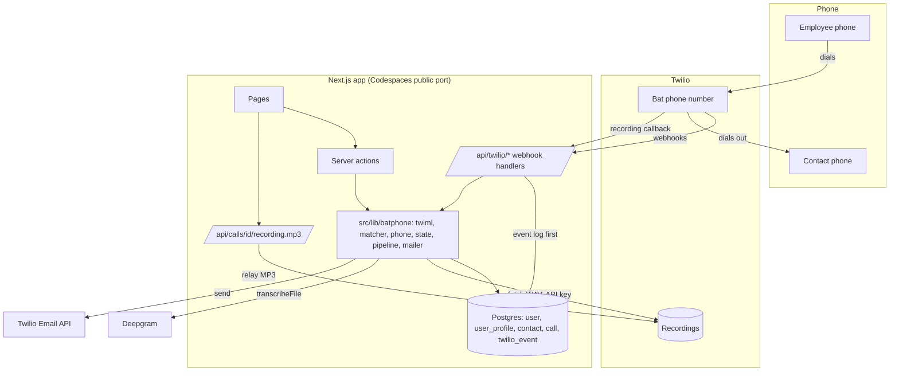
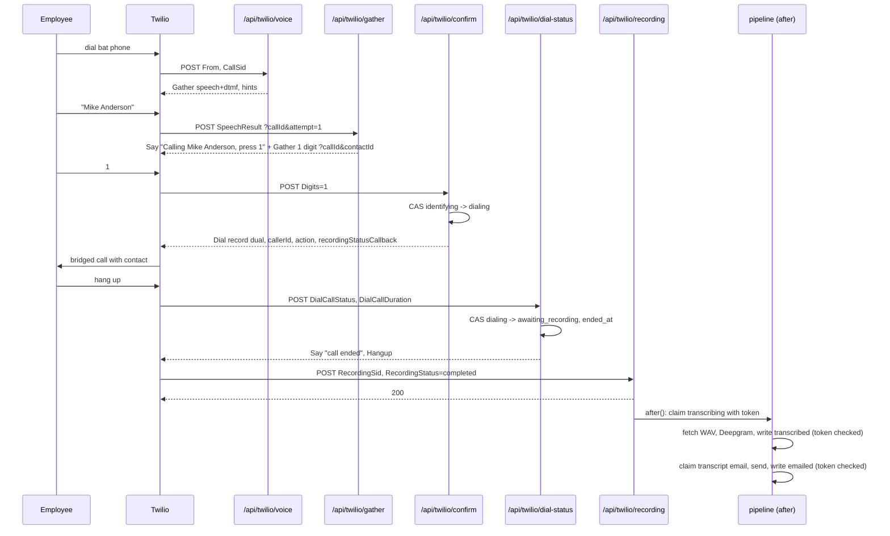
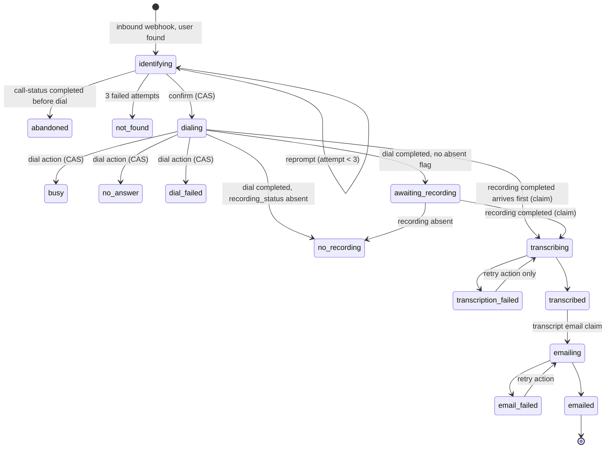

# Bat Phone - Plan

> **Historical planning record — September 11, 2026.** Preserved with editorial updates to focus on the requirements, option analysis, risk gates, and implementation sequence that informed the project. This records intended work, not proof that every check was completed. Start with the [decision story](../DECISIONS.md) for how the implementation evolved, the [architecture](../ARCHITECTURE.md) for current behavior, and [setup](../SETUP.md) for current instructions.
>
> Some original estimates, provider limitations, prompts, and schema proposals have since changed. In particular, trial Verify supports verified recipients, prices should be checked on provider pages, and the final app assigns the lowest available speed-dial code. Use the current guides for these details. References below to this plan governing implementation describe its original role; current contributor instructions remain in [CLAUDE.md](../CLAUDE.md).

## Implementation changes since this plan

This is the initial planning record, not the current setup checklist. The implementation subsequently added:

- A hosted demo on Cloudflare Workers Paid through OpenNext, with Supabase PostgreSQL, certificate-verified Hyperdrive connections, and durable Queues. Codespaces remains the Node/PostgreSQL development path.
- Two-step onboarding: Google-prefilled name confirmation and SMS phone verification, followed by the first contact before home. User-confirmed names drive greetings.
- Native-fetch SMS verification with a deadline and an existing-code recovery path, request-scoped hosted database connections, and atomic lease-expiry checks for queue redelivery.
- Conservative automated-answer labels replace the original voicemail/message-left inference; raw machine detection and caller speech do not identify the type of automation.
- Patched framework/auth dependencies and additional verification of authenticated hosted routes after the Workers Free CPU limit caused Error 1102.

Read [design decisions](../DECISIONS.md) for the evolution, [current architecture](../ARCHITECTURE.md) for the implemented system, [deployment](../DEPLOYMENT.md) for Cloudflare/Supabase, and [verification evidence](../MANUAL_E2E.md#run-log) for completed versus pending checks. Version pins, pricing, callback examples, and proposed guarantees below describe the planning snapshot.

**Target repo:** this directory.
All paths below are relative to the new repo root.

## Goal Capsule

- **Objective:** Build the Bat Phone calling and transcript workflow end to end.
  A mobile-first Next.js app where an employee signs in with Google, saves their phone number and contacts, dials a Twilio number, names a contact by voice or keypad, has the outbound call placed and recorded, and receives a transcript email with call metadata and a recording link.
  Call history and transcripts are also shown in the UI.
- **Authority:** This plan governs scope and approach.
  Repo conventions in `docs/CLAUDE.md` govern code style.
  User instructions override both.
- **Execution profile:** A Next.js application with PostgreSQL and external calling, transcription, and email services.
  Twelve units in five phases.
  Units U1 and U2 must be complete before any telephony work, because they contain the two environment checks that can invalidate the architecture.
- **Stop conditions:** Stop and report if the Twilio account cannot serve custom TwiML from the Codespaces URL, if a Codespaces public port blocks unauthenticated POSTs, or if a proposed change conflicts with the product flow defined below.
- **Tail ownership:** The implementer owns tests, lint, type-check, build, and the manual end-to-end script in U12.
  A product overview video is optional supporting documentation.

---

## Product Contract

### Summary

Build the Bat Phone proof of concept using Next.js, with Twilio Programmable Voice for calling and recording, Deepgram for batch transcription, Twilio Email for the transcript email, and Postgres via Drizzle for users, contacts, and calls.
The app runs in GitHub Codespaces with a public forwarded port for Twilio webhooks and includes a written architecture overview.

### Problem Frame

Bat Phone connects a simple phone interaction to contact resolution, recording, transcription, and email without requiring the recipient to install an app.
The difficult parts are the Twilio webhook sequence under a 15 second response limit, resolving a spoken name against a small contact list reliably, a post-call pipeline that handles duplicate and out-of-order callbacks without a queue, and making all of that reproducible in a clean Codespace whose public URL changes per codespace.
The CRUD screens are not difficult.

### Call Walkthrough

The end-to-end experience in plain terms, with Mike Anderson as the example contact.
Key Flows F2 and the sequence diagram in the Planning Contract describe the same events for implementers.

1. **The employee dials a Twilio number.**
   This is the bat phone.
   It is a real phone number that Twilio owns and that we lease monthly.
   The employee calls it from their own mobile using the normal phone dialler, the same way they would call anyone.
2. **Twilio answers and asks the app what to do.**
   When the call arrives, Twilio does not know what to say.
   It sends an HTTP request to our app with the caller's number.
   The app looks that number up, finds the employee's account, and replies with instructions: play the prompt "Who would you like to call?"
3. **The employee names a contact by voice or keypad.**
   They say "Mike Anderson" out loud, or they press Mike's speed-dial code on the phone keypad.
   Twilio converts the speech to text and sends it to the app.
   The app matches it against that employee's contact list and replies: "Calling Mike Anderson, press 1 to confirm."
   If the name was not understood, the app says what it heard ("I heard my canderson. Who would you like to call?") and asks again, up to three times, offering the keypad code on the last try.
   Every attempt is recorded with what was heard and what the employee did next, and shown on the call's page afterwards.
4. **The outbound call is placed and recorded.**
   After the employee presses 1, the app tells Twilio to dial Mike's number and connect the two calls together.
   Mike's phone rings, showing the Twilio number as the caller.
   Twilio records the conversation from the moment Mike answers, with the employee on one audio channel and Mike on the other.
5. **The call ends and the app is told.**
   When either side hangs up, Twilio sends the app a callback saying the call finished and, shortly after, another saying the recording is ready.
6. **The employee receives a transcript email.**
   The app downloads the recording, sends it to Deepgram for transcription, and emails the employee.
   The email has a header with the call metadata (who called whom, the number dialled, when it started, how long it lasted), then the transcript with each line labelled "You" or "Mike Anderson", then a link.
   The link opens the call's page in the app, where the recording can be played.

There is no phone app.
The "app" is a web server; the employee uses it through a mobile web browser before the call (sign in, verify number, manage contacts) and after it (read transcripts, play recordings).
During the call itself, the employee's phone is on an ordinary voice call and runs nothing of ours; Twilio sends the requests to the server on behalf of the phone network.
A basic phone with no internet would work the same way.
Mike is on the receiving end only: his phone rings with an ordinary call showing the bat phone number, and he has no account, never visits the site, and does not receive the transcript.

### Actors

- A1. **Employee** - signs in with Google, configures their number and contacts, calls the bat phone, receives transcript emails, reviews history.
- A2. **Contact** - the person dialed.
  Sees a call from the Twilio number.
  Never interacts with the app.
- A3. **Twilio** - runs the call and posts webhooks (inbound voice, gather action, dial action, recording status, call status).
- A4. **Operator** - whoever sets up the Codespace, Twilio number, email domain, Google OAuth, and Deepgram credentials.
  Same person as A1 for the demo.

### Requirements

**Identity and setup**

- R1. Users authenticate with Google OAuth.
  The account carries email, one configured phone number, a timezone, and a contact list.
- R2. Users can enter, change, and remove their phone number.
  It is stored in E.164 and is unique across users.
- R25. A phone number is saved only after the user proves they control it: the app sends a one-time code to that number by SMS through Twilio Verify, and the user enters it within the code's validity window.
  Changing the number repeats the check for the new number.
- R3. An inbound call whose caller ID matches a stored number is attributed to that user automatically.
  Anonymous, withheld, non-E.164, or unknown callers hear a short "not registered" message and the call ends.
- R24. Sign-in is limited to an operator-configured allowlist of email addresses or domains.
  Any other Google account is rejected before a user row is created.

**Contacts**

- R4. Users can add, edit, and delete contacts with a name and an E.164 phone number.
  Names are unique per user, case-insensitively.
- R5. Each contact gets a stable speed-dial code shown in the UI so it can be selected by keypad on the call.
  Codes are unique within a user's account; automatic allocation never repeats a value, and a user-chosen value is covered by R29.
- R6. A contact may not equal the user's own number or the bat phone number.
- R27. Two contacts may share a phone number (a household line, a front desk, the same person under two labels).
- R28. The call list, the call page, and the email state the outcome of the outbound leg in plain words: Answered, Voicemail with a message left, Voicemail with no message, Busy, No answer, Call failed, No contact found, Hung up early.
  Voicemail is detected with Twilio answering machine detection on the outbound leg; whether a message was left comes from the caller's channel of the transcript.
  Detection is best effort: an unrecognised pickup is shown as Answered.
  Saving a number that another contact already has shows a notice naming that contact but is allowed.
  When several name matches all dial the same number, the call proceeds with the best-scoring name and no disambiguation prompt, since the choice would not change who is called.
- R29. A contact's speed dial is assigned automatically when the contact is saved and can be changed by the user on the contact.
  Speed dials are unique within one user's contacts; a taken value is rejected with the name of the contact that holds it.
  Automatic assignment takes the lowest number not in use, so a deleted contact's code becomes free again; the earlier forward-only counter was removed the same day.
  Added on 2026-09-14 at Sanjeev's request while reviewing the contacts page; it replaces the earlier "never reused" rule, since a user who picks a code takes responsibility for it.

**Bat phone call**

- R7. After identification, the system asks "Who would you like to call?" and accepts speech or keypad digits in the same prompt.
- R8. Spoken input is resolved against the caller's contacts with fuzzy matching.
  A single strong match is confirmed by keypad before dialing.
  Several close matches produce a numbered disambiguation prompt.
  No match reprompts, and after three failed attempts the call ends with a clear message.
- R9. The outbound call is placed with the Twilio number as caller ID, recorded from answer in dual-channel mode, and limited to 30 minutes.
- R10. Busy, no-answer, failed, and cancelled outcomes are spoken to the caller and recorded in history without an email.
- R11. If the caller hangs up before dialing, the call row is closed as abandoned.
- R26. Every name-resolution attempt is recorded: the input kind (speech or keypad), the text Twilio recognised and its confidence, the matcher's candidates and scores, the decision (match, ambiguous, none), and what the caller did next (confirmed, retried, selected an option, timed out, hung up).
  When speech is not matched, the reprompt tells the caller what was heard.
  The call page shows the attempts so the user can see why a call did or did not connect, and an operator can export them to tune the matcher.

**Post-call pipeline**

- R12. When a recording completes, the system fetches it, transcribes it with speaker separation by channel, stores the transcript, and emails the user.
  Batch transcription is sufficient.
- R13. Every call captures caller, contact name, destination number, start time, duration, and recording reference.
  The email and the UI render the same metadata header.
- R14. The email contains the metadata header, the transcript text, and a link to the call page in the app where the recording plays.
  It has both HTML and plain-text bodies.
- R15. If transcription fails or the recording is absent, the user still gets a metadata-only email that explains what happened, and the UI offers retry.
  A later successful retry sends the full transcript email once.
- R16. Every pipeline step is idempotent.
  Duplicate or out-of-order Twilio callbacks never double-transcribe, double-dial, or double-send.

**Web interface**

- R17. Mobile-first pages for sign in, phone setup, contacts, call history, and call detail with transcript and audio playback.
- R18. Call history lists contact name, number, start time, duration, and a status badge that shows transcript availability or where the pipeline stopped.
- R19. Recording playback goes through an authenticated app route that streams from Twilio and supports byte-range requests.
- R20. Failed transcription or email steps expose a retry action.
  Rows stuck in a non-terminal state after the call has ended expose a resync action that reconciles against Twilio.

**Environment and deliverables**

- R21. The repo runs in GitHub Codespaces from a clean clone: Postgres service, migrations, public port for Twilio, and documented credential setup.
- R22. The README covers setup, env vars, Twilio number configuration, Google OAuth redirect URI per codespace, and the manual end-to-end check.
- R23. A written architecture overview covers system design, Twilio integration, caller identification, contact resolution, transcription, email, data model, tradeoffs, scaling, and limitations.

### Key Flows

- F1. Onboarding
  - **Trigger:** First Google sign-in from an allowlisted address.
  - **Actors:** A1
  - **Steps:** Login redirects to setup when no phone number is stored; user enters their number and receives a code by SMS; user enters the code; the app saves the number and browser timezone; setup shows the bat phone number as a tap-to-dial link; user adds contacts.
  - **Covered by:** R1, R2, R4, R5, R17, R24, R25
- F2. Successful bat phone call
  - **Trigger:** A1 dials the Twilio number from their registered phone.
  - **Actors:** A1, A2, A3
  - **Steps:** Inbound webhook identifies user; call row created; gather prompt; speech resolved to one contact; confirm with 1; dial with dual recording; call ends; dial action records outcome; recording callback triggers transcription and email; history shows emailed.
  - **Covered by:** R3, R7, R8, R9, R12, R13, R14, R16, R18
- F3. Resolution failure paths
  - **Trigger:** Silence, unmatched name, several matches, or a rejected confirmation.
  - **Actors:** A1, A3
  - **Steps:** Record the attempt; reprompt with what was heard and the attempt counter carried in the signed callback URL; disambiguation menu when there are several candidates; keypad fallback prompt on the last attempt; hangup with a spoken message after three failures; the call page later shows every attempt.
  - **Covered by:** R5, R8, R11, R26
- F4. Pipeline failure and recovery
  - **Trigger:** Deepgram or Twilio Email error, absent recording, or a missed callback.
  - **Actors:** A1, A3, A4
  - **Steps:** Row moves to a failed state with the error stored; metadata-only email where a recording exists; call page shows retry; retry re-runs the same step function under a new claim token; resync consults the event log and Twilio when no callback arrived.
  - **Covered by:** R15, R16, R20

### Acceptance Examples

- AE1. Unknown caller
  - **Covers:** R3
  - **Given** no user has phone number +15550001111
  - **When** Twilio posts an inbound call with From +15550001111
  - **Then** the TwiML says the number is not registered and hangs up, no call row is created, the event is stored in the event log, and a warning is logged with the call SID only.
- AE2. Confident speech match
  - **Covers:** R8
  - **Given** contacts "Mike Anderson" and "Sarah Chen"
  - **When** the gather result is "call mike anderson" with confidence 0.9
  - **Then** the TwiML says "Calling Mike Anderson. Press 1 to confirm or 2 to try again" inside a one-digit gather.
- AE3. Ambiguous first name
  - **Covers:** R8
  - **Given** contacts "Mike Anderson" and "Mike Brown"
  - **When** the gather result is "mike"
  - **Then** the TwiML lists both with numbers 1 and 2 and gathers one digit.
- AE4. Keypad selection
  - **Covers:** R5, R7
  - **Given** Sarah Chen has speed-dial code 2
  - **When** the gather result has Digits "2"
  - **Then** the flow proceeds to the confirmation prompt for Sarah Chen.
- AE5. Duplicate recording callback
  - **Covers:** R16
  - **Given** a call row already in state transcribed for recording RE123
  - **When** the same recording-completed callback arrives again
  - **Then** the handler returns 200, no second transcription runs, and no second email is sent.
- AE6. Recording before dial action
  - **Covers:** R16
  - **Given** a call row in state dialing
  - **When** the recording callback arrives before the dial action
  - **Then** the recording is stored and the pipeline runs, and the later dial action only fills in dial outcome fields without changing pipeline state.
- AE7. Transcription failure then recovery
  - **Covers:** R15
  - **Given** Deepgram returns 503 three times
  - **When** the pipeline runs for a completed recording
  - **Then** the row is transcription_failed with the error stored, a metadata-only email with the call link is sent once, the call page shows a retry button, and a later successful retry sends the full transcript email exactly once.
- AE8. Recording playback
  - **Covers:** R19
  - **Given** a signed-in user opening their own call page
  - **When** the browser requests the recording route with Range bytes=0-1
  - **Then** the route responds 206 with a correct Content-Range relayed from Twilio, and a different user gets 404.
- AE9. Confirm delivered twice
  - **Covers:** R16
  - **Given** a call row already in dialing
  - **When** the confirm webhook with Digits 1 is delivered again
  - **Then** the response is a short "already connecting" hangup with no Dial verb and no writes.
- AE10. Non-allowlisted sign-in
  - **Covers:** R24
  - **Given** the allowlist contains only example.com
  - **When** a Google account at other.org signs in
  - **Then** sign-in is refused with a clear message and no user row exists.
- AE13. Two contacts with the same number
  - **Covers:** R27
  - **Given** contacts "Mike Anderson" and "Mike (work)" both saved with +15551234567
  - **When** the gather result is "mike"
  - **Then** no disambiguation prompt is played, the confirmation prompt names the higher-scoring entry, and the call row snapshots that entry's name with the shared number.
- AE12. Resolution feedback
  - **Covers:** R26
  - **Given** contacts "Mike Anderson" and "Sarah Chen"
  - **When** the gather result is "my canderson" with confidence 0.55, the caller is asked to confirm Mike Anderson, and presses 2 to retry
  - **Then** one resolution attempt is stored with input speech, heard text "my canderson", confidence 0.55, candidates Mike Anderson and Sarah Chen with their scores, decision match, and caller response retried; the next prompt says "I heard my canderson. Who would you like to call?"; and the call page lists the attempt.
- AE11. Phone number verification
  - **Covers:** R25
  - **Given** a signed-in user with no phone number
  - **When** they enter +15551234567 and then enter the wrong code, then the right code
  - **Then** the wrong code is rejected with the number still unsaved, the right code saves the number with a verified timestamp, and the profile row holds the number in E.164.

### Scope Boundaries

**In scope:** everything in Requirements, the Codespaces devcontainer, a Twilio number configuration script, the architecture overview, and a documented manual end-to-end check.

**Deferred for later**

- Importing contacts instead of typing them.
  Google Contacts import through the People API is the path that works on every device (one extra OAuth scope requested on demand, a search-and-pick UI, contacts copied into the app's table with no ongoing sync); the browser Contact Picker API is a possible enhancement for Chrome on Android only, since Safari on iOS still keeps it behind a feature flag.
  The employee's own number is typed either way, because it must be verified by SMS.
- Answering machine detection.
  Pulled back into scope on 2026-09-14 after the first real calls; see R28 and U13 below.
  Voicemail is transcribed like any answered call.
- Copying recordings out of Twilio into owned storage.
- Deleting Twilio recordings when a user or call is deleted, and a user-facing delete for calls.
- Bounce and delivery tracking for email.
  A 202 accepted response with an operation id counts as sent; the operation status is not polled.
- Spoken yes/no on the confirmation prompt.
  Confirmation is keypad only.
- Real-time transcription during the call.
- Encryption of transcripts and phone numbers at rest.

**Outside this product's identity**

- Inbound calls to the employee, SMS, browser-based WebRTC calling, multi-tenant organisations, and admin dashboards.

**Deferred to Follow-Up Work**

- Removing `'unsafe-eval'` from the CSP in `next.config.ts`.
- Replacing the hardcoded green accent in `src/components/navigation/mobile-nav-panel.tsx` with semantic tokens.

### Dependencies and Assumptions

- Twilio account upgraded to pay-as-you-go before U2, with one voice-capable number and a Verify service.
  The number is leased monthly ($1.15 for a US local number).
  A trial account is not used: trial accounts play an announcement on both legs of every call, which would be recorded in the demo and in channel 1 of the recording, they can only call numbers pre-verified in the console, and they cannot send the verification SMS that R25 requires.
  Expected spend for the project is a few dollars: the number lease, about 9 cents of voice and recording per ten-minute call, and about 6 cents per phone verification ($0.05 per successful Verify check plus $0.0083 per US SMS).
  On a pay-as-you-go account, the sign-in allowlist and geographic permissions are the only protection against billed abuse.
- Deepgram account with the pay-as-you-go free credit.
- Twilio Email with an authenticated domain.
  Twilio Email is the email product built into the Twilio console and is authenticated with the same Twilio API key as voice; it verifies senders by domain only, so the operator adds Twilio's DNS records to a domain they control (`sanjeevnandam.com` for the demo) and the From address is on that domain.
  It bills $0.0013 per email on the same Twilio balance, with 100 free emails per day for the first 30 days.
  The mailer is implemented behind an interface so a swap is a one-file change.
- Google Cloud OAuth client.
  Each new codespace hostname must be added as an authorised redirect URI, since Google does not allow wildcards.
- GitHub Codespaces with the github-cli devcontainer feature installed and a `GH_TOKEN` repository secret carrying the `codespace` scope, since the token a codespace injects cannot change port visibility.
  All other credentials arrive as Codespaces repository secrets rather than committed env files.

### Outstanding Questions

- **Deferred (non-blocking):** Exact Twilio speech model and timeout combination.
  Hints are documented for Google V2 and Deepgram nova-2 models but not nova-3, and `speechTimeout="auto"` is rejected by some models.
  Default: `googlev2_telephony_short` with a numeric speech timeout, tuned during U7 against real calls.

---

## Planning Contract

### Key Technical Decisions

- **Use a server-rendered Next.js application.**
  The product is server-driven through Twilio webhooks.
  Offline-first storage and a service worker add the risk of stale call history during a demo and require webpack builds.
- **Sign-in allowlist enforced in a Better Auth hook.**
  The app is reachable on a public port and places billed outbound calls, so open Google sign-up would let anyone place calls at the operator's expense.
  `ALLOWED_EMAILS` and `ALLOWED_EMAIL_DOMAINS` are checked before user creation.
  Twilio geographic permissions are restricted to the demo countries as a second control.
- **Validate Twilio signatures against a configured `PUBLIC_BASE_URL`, never `request.url`.**
  Next.js does not rewrite the request URL from forwarded headers, so inside Codespaces the app sees `http://localhost:3000` while Twilio signed the public HTTPS URL.
  The validation URL is the base URL plus the request path plus the raw query string exactly as received; re-serialising the query breaks signatures.
  The same value is used for every TwiML callback URL, `BETTER_AUTH_URL`, and the Google redirect URI.
- **Carry per-call state in signed query strings, and bind every request to its row.**
  Attempt counters and the candidate contact for confirmation are carried in the callback URL.
  Twilio signs the full URL and body together, so query and body cannot be mixed across calls.
  Each handler still checks that the row for the query's call id has the body's CallSid, that the row's user owns any contact id in the query, and that the row is younger than 24 hours; a mismatch returns goodbye TwiML with no writes.
  This prevents replay of a genuine callback without a nonce.
- **Every state change is a compare-and-set from the state the handler expects.**
  One conditional update per transition that also sets `claimed_at` from database time, a new `claim_token`, and the step's attempt counter, and clears `last_error`.
  Zero rows updated means another request already acted; the handler returns a harmless response and writes nothing.
  The confirm handler in particular returns a Dial verb only when it is the request that moved the row from identifying to dialing.
- **Claim tokens prevent a superseded job from writing.**
  Every completion or failure write for a pipeline step includes the claim token it was started with.
  A job that lost its claim to a manual retry or a stale-claim takeover updates zero rows, logs, and stops before any email is sent.
- **Append-only Twilio event log.**
  Every Twilio handler stores the raw callback (call SID, recording SID, event kind, payload, received time) before acting.
  Unknown call SIDs are stored and acknowledged rather than turned into stub rows, which the not-null user foreign key forbids anyway.
  Resync reads the event log before calling Twilio.
- **Email tracking is in its own columns, not in the status.**
  `status` describes the recording and transcript lifecycle only.
  `metadata_email_sent_at` and `transcript_email_sent_at` record each email kind once.
  A transcription retry after a metadata-only email therefore still ends with the full email, and each kind can never be sent twice.
- **Return TwiML within the 15 second Twilio limit and run pipeline work in `after()`.**
  The recording callback persists, returns 200, and schedules processing with `after()` from `next/server`, which is stable and waits for pending callbacks on SIGTERM on a Node server.
  No queue, no worker, no internal fetch.
  Stale claims are the expected failure when a codespace stops, so stale detection and retry are explicit parts of the design.
- **Dual-channel recording with Deepgram multichannel, no diarization.**
  `record-from-answer-dual` puts the caller on channel 0 and the contact on channel 1.
  Deepgram `multichannel` with `utterances` returns speaker-labelled text without a separate speaker-detection step.
  Diarization adds nothing here and is deprecated in favour of a model parameter.
- **Download media from Twilio with an API key, then upload the buffer to Deepgram.**
  Media auth is enforced on new Twilio accounts.
  Passing a credentialled URL to Deepgram would give credentials to a third party.
  The WAV variant with `RequestedChannels=2` is fetched for transcription; the MP3 variant is streamed for playback.
- **Credentials are scoped by use.**
  `TWILIO_AUTH_TOKEN` is read only by the signature validator.
  Media fetch, resync, and the configure script use a standard Twilio API key.
  The Deepgram key carries only the usage write scope.
  Email goes through the same Twilio API key, since Twilio Email is part of the Twilio account.
  Secrets arrive through Codespaces repository secrets.
- **TwiML comes only from the Twilio response builder, and email templates escape every interpolated value.**
  Contact names and the contact's speech are untrusted input that reaches TwiML, Gather hints, and the inbox.
- **Contact matcher is a pure function using token scoring with Jaro-Winkler and Double Metaphone plus a nickname map.**
  Contact lists are under 50 entries, so scoring every contact is acceptable and fully unit-testable.
  Contact names are passed as Gather hints to bias recognition.
  Thresholds: accept at 0.85 with a 0.15 margin over the runner-up, disambiguate when two or more score 0.7 or higher, otherwise reprompt.
- **Every resolution attempt is stored in its own table and shown to the user.**
  Speech recognition and fuzzy matching will be wrong sometimes, and the only way to improve them is to know what was heard and what the matcher did with it.
  The gather handler writes a `resolution_attempt` row before replying, and the confirm handler updates that row with the caller's response.
  The call page lists the attempts in plain language, so a user who could not reach someone sees "I heard 'my canderson'" instead of nothing, and can fix the contact name or add a nickname.
  A report script exports attempts across all calls so the operator can add real misses to the matcher test table.
  The raw Twilio callback in `twilio_event` is not enough on its own because it does not contain the matcher's candidates, scores, or the caller's later response.
- **Keypad path uses per-contact speed-dial codes allocated from a per-user counter.**
  Codes come from `next_speed_dial` on the profile, incremented in the same transaction as the insert, so a deleted code is never reissued to someone else.
  Codes are shown in the contacts list and give a deterministic fallback when speech fails.
- **Always confirm before dialing, with a one-digit DTMF gather.**
  Timeout on the confirmation counts as "try again", not as consent.
  Dialing the wrong person is the worse failure.
- **Store E.164 only and validate with `libphonenumber-js`.**
  Twilio's From is E.164 for real numbers, so identification is an equality lookup on a unique column.
  Anonymous sentinels and non-E.164 values go to the unknown-caller path without a database lookup.
- **Prove number ownership with Twilio Verify before saving.**
  Caller ID identifies the employee on every call, so a number registered by the wrong person would route that person's calls and transcripts to the wrong account.
  Setup sends a one-time code through a Twilio Verify service and saves the number only when the code is confirmed.
  Verify is used rather than sending SMS from the bat phone number because SMS to US numbers from a local number requires A2P 10DLC business registration, which takes days; Verify sends from Twilio's pre-registered pool.
  Verify keeps the pending state, expires codes after ten minutes, and limits attempts, so the app stores nothing until confirmation.
- **Start time and duration come from the recording, with dial values as fallback.**
  The transcript header's "call start" and "duration" mean the time the two parties were talking.
  `RecordingStartTime` and `RecordingDuration` are stored alongside `DialCallDuration`, the inbound time, and `ended_at`.
- **Email links to the app's call page, never to the Twilio media URL.**
  The recording route checks session and row ownership, relays only an allowlist of headers from Twilio's response, and never forwards upstream error bodies.
  Playback is same-origin, so the CSP does not change.
- **Mailer behind an interface.**
  `sendTranscriptEmail` and `sendMetadataOnlyEmail` are implemented once against a small `Mailer` type.
  Twilio Email is the shipped implementation: one POST to `https://comms.twilio.com/v1/Emails` with the Twilio API key as basic auth, no SDK dependency.
  Twilio Email has no sandbox mode, so the mailer has a dry-run mode (`EMAIL_DRY_RUN`) that logs the message instead of sending; it is honoured only outside production or when explicitly forced, is logged at startup, and is visible in the UI.
- **Timezone captured from the browser at phone setup.**
  Stored on the user profile, defaulting to UTC.
  All timestamps stay UTC in Postgres; formatting happens at render time with the stored zone so the email and UI agree, except when the user changes zone later, which the README notes.
- **Logger redaction is enforced in code and tested.**
  The logger masks E.164 patterns to their last two digits in every context value and error message and truncates messages, and handlers log only a safe call context (call id, call SID, status, attempt).
  A test proves it.
- **Committed migrations everywhere, never a schema push.**
  Keep migrations under `drizzle/`, enforce schema drift checks, and run `migrate` in the Docker migrations stage.
  U3 adds the Bat Phone tables the same way.
  The devcontainer runs `db:migrate` on both create and start.
  There is no push step, since a push writes no journal and the first `migrate` after it fails on tables that already exist.
  Reset from inside the codespace is a `db:reset` script that drops and recreates the schema, then migrates and seeds; `docker compose down -v` applies only to the root compose file outside Codespaces.
- **Codespaces port visibility is set at attach time with the `gh` CLI.**
  `visibility` is not a valid devcontainer.json key.
  The devcontainer adds the github-cli feature, and a `postAttachCommand` runs `gh codespace ports visibility 3000:public -c "$CODESPACE_NAME"` with `GH_TOKEN` from a repository secret, warning and continuing when it fails so attach stays usable; the README names the manual Ports panel fallback.
  A `postStartCommand` runs the Twilio configure script so the number's webhooks point at the current public URL.
- **Handlers stay thin; domain logic is in `src/lib/batphone/`.**
  TwiML builders, the matcher, phone normalisation, the state machine, the pipeline steps, and the mailer are plain modules with no Next.js imports so they can be unit-tested in the default jsdom environment.
  Route handlers and server actions call them and are tested in node environment with the DB module mocked.
- **Versions.**
  Node 22.
  `twilio` 6.x, `@deepgram/sdk` 5.x (class client, `listen.v1.media`, throws on error), `@sendgrid/mail` 8.x, `libphonenumber-js` 1.x, `double-metaphone` 2.x.
  Pin Better Auth 1.4.18 in the lockfile and use the matching documentation for hook APIs.
  Pin Next.js to 16.1.6.
  Allow multiple development database connections so an `after()` job cannot block an incoming webhook from getting a connection.

### Tool Selection

These tables compare the services and application approaches considered for the workflow, recording the fit and reason for each choice.
All prices were read from the vendors' own pricing pages on 2026-09-11 (links in Sources and Research).
For scale: a ten-minute two-party call costs about 9 cents of Twilio voice and recording, about 9 cents of Deepgram transcription (two channels), and $0.0013 per email sent.
The bat phone number itself is leased from Twilio at $1.15 per month for a US local number ($2.15 for toll-free), billed monthly from the purchase date; releasing the number stops the charge.
Each phone number verification at setup costs $0.05 for the Verify check plus $0.0083 for the US SMS.

**Telephony**

| Option                                 | What it is                                                                              | Fit for Bat Phone                                                                                                                                                                   | Verdict                                                                 |
| -------------------------------------- | --------------------------------------------------------------------------------------- | ----------------------------------------------------------------------------------------------------------------------------------------------------------------------------------- | ----------------------------------------------------------------------- |
| Programmable Voice (Voice API + TwiML) | Inbound webhooks, TwiML verbs (`Gather`, `Dial`, recording), REST API, status callbacks | Provides every operation the flow needs: identify caller, prompt, capture speech or digits, bridge with dual-channel recording, callbacks on completion                             | **Chosen.** "Voice API" and "Programmable Voice" are one product family |
| Conversations                          | Multi-channel messaging (SMS, chat, WhatsApp)                                           | Not a voice product; no call control                                                                                                                                                | Not applicable                                                          |
| Conversational Intelligence            | Post-call transcripts and language operators attached to recordings                     | Could replace Deepgram; GA since 2024; batch transcription is $0.024 per minute against Deepgram's $0.0043 per channel-minute, and it adds a second asynchronous webhook to wait on | Not used; recorded as the all-Twilio alternative                        |
| ConversationRelay / Conversational AI  | Streams call audio to your own LLM agent over WebSockets for open-ended dialogue        | Much more infrastructure than a single question needs; harder to make deterministic and testable                                                                                    | Not used; `Gather` with hints and a pure matcher is sufficient          |

**Speech capture for the contact name**

| Option                                                  | Fit                                                                                                                               | Verdict    |
| ------------------------------------------------------- | --------------------------------------------------------------------------------------------------------------------------------- | ---------- |
| Twilio `Gather input="speech dtmf"` with `hints`        | One TwiML verb returns `SpeechResult` and `Digits` in the same callback; contact names bias recognition; keypad input is included | **Chosen** |
| Streaming audio to Deepgram or another STT in real time | Needs media streams and a WebSocket server; more than a two-second utterance requires                                             | Not used   |
| ConversationRelay with an LLM resolving the name        | Adds an LLM in the call path, latency, and non-determinism                                                                        | Not used   |

**Transcription**

| Option                              | Price (batch)                                                                                   | Speaker separation by channel                                                                                                                | Free tier                                  | Notes                                                                                            | Verdict                                               |
| ----------------------------------- | ----------------------------------------------------------------------------------------------- | -------------------------------------------------------------------------------------------------------------------------------------------- | ------------------------------------------ | ------------------------------------------------------------------------------------------------ | ----------------------------------------------------- |
| Deepgram (Nova-3)                   | $0.0043 per minute per channel; a two-channel file bills twice                                  | Native `multichannel`; utterances carry channel and timestamps, so caller and contact are labelled without a separate speaker-detection step | $200 credit, no card                       | One call with the audio buffer; SDK v5 is a breaking rewrite and most tutorials show the old API | **Chosen**                                            |
| AssemblyAI (Universal)              | $0.21 per hour, about $0.0035 per minute, billed per channel; speaker labels add $0.02 per hour | Multichannel and diarization available                                                                                                       | $50 credit, no card                        | Slightly cheaper per minute with the same feature set; no prior use in this team                 | Viable second choice                                  |
| OpenAI (Whisper, gpt-transcribe)    | $0.006 per minute (Whisper), $0.0045 (gpt-transcribe), $0.003 (gpt-4o-mini-transcribe)          | None on the batch models; a dual-channel file must be split and transcribed twice, then merged by timestamp                                  | No free API tier; self-hosting needs a GPU | The single-channel rate is competitive, but we would have to do the speaker labelling ourselves  | Not used                                              |
| Twilio Conversational Intelligence  | $0.024 per minute                                                                               | Per media channel                                                                                                                            | Trial units only                           | Single vendor, five to six times Deepgram's rate, and a second webhook                           | Not used; alternative if a single vendor is preferred |
| Twilio legacy `<Record transcribe>` | Attribute on `Record` only                                                                      | No                                                                                                                                           | Included                                   | English only, 2 second to 120 second limit, and unavailable on `Dial` recordings                 | Not applicable                                        |

**Email**

| Option                                       | Setup                                                                                         | Free tier                                                                                                                             | Deliverability                                                        | Notes                                                                                                                                                              | Verdict                               |
| -------------------------------------------- | --------------------------------------------------------------------------------------------- | ------------------------------------------------------------------------------------------------------------------------------------- | --------------------------------------------------------------------- | ------------------------------------------------------------------------------------------------------------------------------------------------------------------ | ------------------------------------- |
| Twilio Email (built into the Twilio console) | Domain authentication by DNS records; sends with the existing Twilio API key; no sandbox mode | $0.0013 per email, no plan; 100 free per day for the first 30 days                                                                    | Same infrastructure as SendGrid, sending from an authenticated domain | One account, one API key, and one bill for calls, verification, and mail; one REST call, no SDK; requires a domain you control (the demo uses `sanjeevnandam.com`) | **Chosen**, behind a mailer interface |
| SendGrid (classic console)                   | API key plus single-sender or domain verification; sandbox mode for tests                     | Permanent free plan retired 27 May 2025; new accounts get a 60-day trial at 100 emails per day, then sending pauses until a paid plan | Mature transactional platform                                         | A Gmail From address triggers a DMARC warning and lands in spam; the unified Twilio login now routes to Twilio Email instead                                       | Not used; same vendor as the pick     |
| Postmark                                     | API key; account approval process; transactional-only                                         | 100 emails per month, no expiry; Basic plan $15 per month for 10,000                                                                  | Strong reputation for transactional mail                              | Best inbox placement and the only option with a lasting free tier; a second vendor to onboard                                                                      | Viable second choice                  |
| Amazon SES                                   | IAM credentials, domain verification, sandbox until production access is granted              | $0.10 per 1,000 à la carte; new accounts get up to $200 in credits for 6 months                                                       | Depends on your own sending reputation                                | Cheapest at scale, most setup; the AWS account here is read-only by policy, which blocks creating the identities                                                   | Not used                              |
| Resend                                       | API key and sender configuration                                                              | Free developer tier                                                                                                                   | Good                                                                  | Additional provider account and sender configuration                                                                                                               | Not used                              |

**Application stack**

| Concern                 | Options                                                                     | Pick                                                   | Why                                                                                                                                                         |
| ----------------------- | --------------------------------------------------------------------------- | ------------------------------------------------------ | ----------------------------------------------------------------------------------------------------------------------------------------------------------- |
| Frontend and backend    | Next.js with Node route handlers, or Next.js plus a separate Python service | Next.js 16 with Node route handlers and server actions | One codebase, one deploy, one process for Twilio to call; `after()` handles post-response work without a worker                                             |
| Persistent storage      | Postgres, SQLite, a hosted document store                                   | Postgres via Drizzle                                   | Compare-and-set claims and unique constraints on Twilio SIDs are the idempotency mechanism; committed migrations and drift tests keep the schema consistent |
| Authentication          | Better Auth with Google, NextAuth, a hosted provider                        | Better Auth with Google plus a sign-in allowlist       | Drizzle adapter for persisted sessions and a Google OAuth callback flow; the allowlist prevents billed abuse on a public port                               |
| Public URL for webhooks | Codespaces public forwarded port, ngrok or a tunnel, a hosted deploy        | Codespaces public port                                 | Available in the development environment without an extra service; a tunnel is the documented fallback if the port blocks non-browser POSTs                 |

### High-Level Technical Design

**Component topology**



**Call sequence, happy path**



**Call row state machine (status column)**



Email columns are tracked separately from the status.
The metadata-only email is claimed from transcription_failed or no_recording when `metadata_email_sent_at` is null and never changes the status.
The transcript email is claimed from transcribed when `transcript_email_sent_at` is null and moves the status to emailed.
A recording absent callback arriving while the row is still dialing only sets `recording_status`, and the dial action then decides between busy, no_answer, dial_failed, and no_recording.

Retryable states: `transcription_failed`, `email_failed`, and stale claims.
A `transcribing` claim is stale after ten minutes plus two seconds per recorded second.
An `emailing` claim is stale after ten minutes and is treated as "possibly sent", so it is never retried automatically and the UI retry warns about a duplicate.
Stuck detection for `dialing` and `awaiting_recording` requires `ended_at` older than ten minutes, or `inbound_at` older than 45 minutes when `ended_at` is null, so a live 12 minute call is never flagged.

### Data Model

```mermaid
erDiagram
  user ||--|| user_profile : has
  user ||--o{ contact : owns
  user ||--o{ call : initiates
  contact o|--o{ call : "snapshotted into"
  call ||--o{ twilio_event : "by call_sid"
  user_profile {
    text user_id PK_FK
    text phone_number UK "E.164, nullable, set only after verification"
    timestamptz phone_verified_at "nullable"
    text timezone "IANA, default UTC"
    int next_speed_dial "default 1"
  }
  contact {
    text id PK
    text user_id FK
    text name
    text name_normalized "unique per user"
    text phone "E.164"
    int speed_dial "unique per user; automatic or user-chosen"
  }
  call {
    text id PK "crypto.randomUUID"
    text user_id FK
    text contact_id FK "nullable, set null on delete"
    text contact_name_snapshot
    text destination_number_snapshot
    text from_number
    text twilio_call_sid UK
    text dial_call_sid UK "nullable"
    text recording_sid UK "nullable"
    text recording_status "nullable: completed, absent"
    text status
    text claim_token
    timestamptz claimed_at
    text last_error
    int transcribe_attempts
    timestamptz inbound_at
    timestamptz ended_at
    timestamptz recording_started_at
    int recording_duration_sec
    int dial_duration_sec
    jsonb transcript "reduced shape, no word arrays"
    text transcript_text
    int email_attempts
    timestamptz email_claimed_at
    text last_email_error
    timestamptz metadata_email_sent_at
    timestamptz transcript_email_sent_at
    text email_message_id
    text emailed_to
  }
  twilio_event {
    text id PK
    text call_sid "indexed"
    text recording_sid "nullable"
    text event_kind
    jsonb payload
    timestamptz received_at
  }
  call ||--o{ resolution_attempt : "has"
  resolution_attempt {
    text id PK
    text call_id FK "indexed"
    int attempt_number
    text input_kind "speech or digits"
    text heard_text "SpeechResult or Digits"
    real confidence "nullable"
    text normalized_query
    jsonb candidates "contact id, name, score, ordered"
    text decision "match, ambiguous, none"
    text chosen_contact_id "nullable"
    text caller_response "nullable: confirmed, retried, selected, timeout, hung_up"
    int selected_position "nullable"
    timestamptz created_at
    timestamptz responded_at "nullable"
  }
```

Indexes: `call (user_id, inbound_at desc)` for history, `twilio_event (call_sid)`, `resolution_attempt (call_id)`.
`resolution_attempt` rows are deleted with their call.
A `hung_up` response is set by the call-status handler when the call ends while an attempt is still unanswered.
The transcript column stores model, request id, per-channel confidence, the identical-channels flag, and utterances as channel, start, end, text, and confidence.
Word arrays and any media URL are never stored.
`transcript_text` is a pure function of the jsonb.
`listCalls` projects columns and never selects the transcript.

### Output Structure

Domain files and integration points:

```text
.devcontainer/
  devcontainer.json
  docker-compose.yml
drizzle/                 (committed migrations from U3)
scripts/
  twilio-configure.ts
  codespace-env.sh
docs/
  ARCHITECTURE.md
  MANUAL_E2E.md
src/actions/
  contacts/index.ts
  calls/index.ts
  user/phone.ts
src/app/
  setup/page.tsx, setup-form.tsx, loading.tsx, error.tsx
  contacts/page.tsx, contact-form.tsx, contact-list.tsx, loading.tsx, error.tsx
  calls/page.tsx, loading.tsx, error.tsx
  calls/[id]/page.tsx, call-actions.tsx, loading.tsx, error.tsx
  api/twilio/voice/route.ts
  api/twilio/gather/route.ts
  api/twilio/confirm/route.ts
  api/twilio/dial-status/route.ts
  api/twilio/recording/route.ts
  api/twilio/call-status/route.ts
  api/calls/[id]/recording.mp3/route.ts
src/db/schema/
  contacts.ts
  calls.ts
  twilio-events.ts
  resolution-attempts.ts
scripts/
  resolution-report.ts   (export attempts for matcher tuning)
src/lib/batphone/
  config.ts            (env access, PUBLIC_BASE_URL derivation, callback URL builder)
  phone.ts             (E.164 normalise, anonymous sentinels)
  twilio-request.ts    (form parsing, signature validation, row binding, TwiML response, error wrapper, safe log context)
  twiml.ts             (prompt builders on the Twilio response builder)
  matcher.ts           (pure contact resolution)
  nicknames.ts
  state.ts             (status enum, transitions, stale and stuck rules, badges)
  calls-repo.ts        (all DB access for call rows and events, CAS claims)
  pipeline.ts          (processRecording, transcribe step, email steps, retry, resync)
  twilio-media.ts      (authenticated media fetch with backoff)
  transcription.ts     (Deepgram client, channel merge, reduced transcript shape)
  mailer.ts            (Mailer type, Twilio Email implementation, dry-run gating)
  email-templates.ts   (escaped HTML and text renderers)
  format.ts            (date/time in user zone, duration)
src/lib/validations/
  phone.ts
  contacts.ts
src/test/fixtures/twilio/
  inbound.json, gather-speech.json, gather-digits.json, dial-action.json,
  recording-completed.json, recording-absent.json, call-status-completed.json
src/test/fixtures/deepgram/multichannel.json
```

### Sequencing

Phase A (foundation): U1, U2, U3.
Phase B (web setup): U4, U5.
Phase C (telephony): U6, U7, U8.
Phase D (pipeline and UI): U9, U10, U11.
Phase E (docs and hardening): U12.
Phase C cannot start until U2's environment checks pass; a failed check stops the plan per the Goal Capsule.

---

## Implementation Units

### Unit Index

| U-ID | Title                                                                     | Key files                                                                                                           | Depends on |
| ---- | ------------------------------------------------------------------------- | ------------------------------------------------------------------------------------------------------------------- | ---------- |
| U1   | Application setup and sign-in allowlist                                   | `package.json`, `src/lib/auth.ts`, `src/constants/index.ts`, `src/app/page.tsx`, `README.md`                        | none       |
| U2   | Codespaces devcontainer, public URL, Twilio configure, environment checks | `.devcontainer/*`, `scripts/*`, `src/lib/batphone/config.ts`, `src/instrumentation.ts`                              | U1         |
| U3   | Schema, migrations, state rules                                           | `src/db/schema/*.ts`, `drizzle/*`, `src/lib/batphone/state.ts`                                                      | U1         |
| U4   | Phone number setup with SMS verification, and onboarding                  | `src/lib/batphone/phone.ts`, `src/lib/batphone/verify.ts`, `src/actions/user/phone.ts`, `src/app/setup/*`           | U3         |
| U5   | Contacts CRUD with speed-dial codes                                       | `src/actions/contacts/*`, `src/app/contacts/*`                                                                      | U3         |
| U6   | Twilio webhook foundation, event log, inbound handler, logger redaction   | `src/lib/batphone/twilio-request.ts`, `twiml.ts`, `src/lib/logger.ts`, `api/twilio/voice`, `api/twilio/call-status` | U2, U3, U4 |
| U7   | Contact matcher, gather and confirm handlers, resolution feedback         | `src/lib/batphone/matcher.ts`, `api/twilio/gather`, `api/twilio/confirm`                                            | U5, U6     |
| U8   | Dial, dial action, recording callback, pipeline claims                    | `api/twilio/dial-status`, `api/twilio/recording`, `src/lib/batphone/pipeline.ts`                                    | U7         |
| U9   | Transcription step                                                        | `src/lib/batphone/twilio-media.ts`, `transcription.ts`                                                              | U8         |
| U10  | Email steps and templates                                                 | `src/lib/batphone/mailer.ts`, `email-templates.ts`                                                                  | U9         |
| U11  | Call history, call detail, recording proxy, retry and resync              | `src/app/calls/*`, `api/calls/[id]/recording.mp3`, `src/actions/calls/*`                                            | U10        |
| U12  | Docs, manual E2E, CI hardening                                            | `README.md`, `docs/ARCHITECTURE.md`, `docs/MANUAL_E2E.md`, `.github/workflows/ci.yml`                               | U11        |

### U1. Application setup and sign-in allowlist

- **Goal:** A focused Bat Phone application with sign-in restricted to allowlisted accounts and passing type-check, lint, test, and build.
- **Requirements:** R21, R24
- **Dependencies:** none
- **Files:** `package.json`, `src/lib/auth.ts`, `src/lib/auth.test.ts`, `src/db/schema/users.ts`, `src/db/primary.ts`, `src/components/layouts/navbar.tsx`, `src/constants/index.ts`, `src/proxy.ts`, `src/proxy.test.ts`, `src/app/page.tsx`, `src/app/api/health/route.ts`, `src/app/api/ready/route.ts`, `.env.example`, `README.md`, `docs/CLAUDE.md`
- **Approach:** Configure authentication, navigation, database access, and health checks for Bat Phone.
  `user_profile` keeps only `userId`, timestamps, and the columns U3 adds; the Better Auth after-create hook inserts `{ userId }` only.
  Add a Better Auth before-sign-in hook that reads `ALLOWED_EMAILS` and `ALLOWED_EMAIL_DOMAINS` and rejects any other account with a clear error, with the allowlist check in a pure helper.
  Resolve the navbar session client-side and show Contacts and Calls links whenever a session exists.
  Update `proxy.test.ts` for the new protected routes.
  The home page becomes a short product page with the bat phone number for signed-in users and a sign-in prompt otherwise.
  The health and ready routes return status and timestamp only, without error text.
  The dev pool size in `src/db/primary.ts` rises to at least four.
  The env example lists only the variables this product uses.
- **Patterns to follow:** `docs/CLAUDE.md` file naming and layout rules.
- **Test scenarios:**
  - Covers AE10. Allowlist helper accepts an exact address, accepts a domain match, rejects a subdomain when only the apex is listed, rejects when both lists are empty, and is case-insensitive.
  - Validation and utility tests cover the application configuration.
- **Verification:** Fresh `npm ci` then type-check, lint, test, and build all pass with dummy env; `docker build .` succeeds; a non-allowlisted Google account cannot sign in.

### U2. Codespaces devcontainer, public URL, Twilio configure script, and environment checks

- **Goal:** A clean Codespace starts with Postgres, applies migrations, exposes port 3000 publicly, derives `PUBLIC_BASE_URL`, points the Twilio number at it, and the two environment checks pass.
- **Requirements:** R21, R22
- **Dependencies:** U1
- **Files:** `.devcontainer/devcontainer.json`, `.devcontainer/docker-compose.yml`, `scripts/codespace-env.sh`, `scripts/twilio-configure.ts`, `scripts/db-reset.ts`, `package.json`, `src/lib/batphone/config.ts`, `src/lib/batphone/config.test.ts`, `src/instrumentation.ts`, `.env.example`, `README.md`
- **Approach:** Compose-based devcontainer: a Node 22 dev service with the github-cli feature plus `postgres:16-alpine`, `forwardPorts: [3000]`.
  `postCreateCommand` waits for Postgres, installs, and runs `db:migrate`.
  `postStartCommand` runs `db:migrate` again and then the Twilio configure script when credentials exist.
  `postAttachCommand` sets port 3000 public with `gh codespace ports visibility 3000:public -c "$CODESPACE_NAME"` using the `GH_TOKEN` secret, printing a warning that names the manual Ports panel step when it fails.
  A `db:reset` npm script drops and recreates the public schema, then migrates and seeds, since Docker is not available from inside the dev container.
  `config.ts` resolves `PUBLIC_BASE_URL` in priority order: explicit env, then `https://${CODESPACE_NAME}-3000.${GITHUB_CODESPACES_PORT_FORWARDING_DOMAIN}` when `CODESPACES` is set, then `http://localhost:3000`.
  It also exposes a `callbackUrl(path, query)` builder used by every TwiML verb, and typed accessors for each credential so the auth token is only reachable from the signature validator.
  `BETTER_AUTH_URL` and `NEXT_PUBLIC_APP_URL` default to the same value.
  `twilio-configure.ts` authenticates with the API key, looks up the number by `TWILIO_PHONE_NUMBER`, sets voice URL, voice fallback URL, and status callback, and prints what it set.
  Instrumentation adds the Twilio (including `TWILIO_VERIFY_SERVICE_SID`), Deepgram, `EMAIL_FROM`, allowlist, and public URL variables to the startup env check and logs the resolved public URL.
  Check one: from outside the codespace, POST to the public voice URL and confirm a 403 from signature validation rather than a GitHub login page.
  Check two: point the number at the app's hello-world TwiML and confirm custom TwiML plays with no announcement on either leg, which also confirms the account is upgraded.
  Both results are recorded in the README along with the Twilio geographic permission setting.
  The configure script also creates the Twilio Verify service if `TWILIO_VERIFY_SERVICE_SID` is unset and prints the SID to add to the secrets.
- **Patterns to follow:** existing `docker-compose.yml` health check; `src/instrumentation.ts` env check list.
- **Execution note:** This is environment work; prefer a runtime smoke check over unit coverage, except for the pure URL derivation.
- **Test scenarios:**
  - Happy path: with `CODESPACES=true`, `CODESPACE_NAME=abc`, and the forwarding domain set, the derived base URL is `https://abc-3000.app.github.dev`.
  - Explicit `PUBLIC_BASE_URL` takes precedence over Codespaces variables.
  - Neither set yields `http://localhost:3000`.
  - `callbackUrl("/api/twilio/gather", { callId: "x", attempt: 2 })` produces the absolute URL with an encoded query string and no trailing slash.
  - Edge: a base URL with a trailing slash is normalised.
- **Verification:** A fresh codespace reaches a running app at the public URL with the database ready; the external POST check returns 403; the TwiML check plays custom audio with no announcement; the configure script output shows the number's voice URL equal to the derived base URL and a Verify service SID.

### U3. Schema, migrations, and state rules

- **Goal:** Drizzle tables, committed migrations, and the call status vocabulary with its transition, stale, and stuck rules that every later unit depends on.
- **Requirements:** R1, R2, R4, R5, R13, R16, R20
- **Dependencies:** U1
- **Files:** `src/db/schema/users.ts`, `src/db/schema/contacts.ts`, `src/db/schema/calls.ts`, `src/db/schema/twilio-events.ts`, `src/db/schema/resolution-attempts.ts`, `src/db/schema/index.ts`, `drizzle/*`, `src/lib/batphone/state.ts`, `src/lib/batphone/state.test.ts`, `src/db/seed.ts`
- **Approach:** Columns per the Data Model.
  `user_profile` gains nullable unique `phone_number`, nullable `phone_verified_at`, `timezone` default UTC, and `next_speed_dial` default 1.
  `contact` gets unique indexes on `(user_id, name_normalized)` and `(user_id, speed_dial)`, cascade delete from user.
  `call` keys on unique `twilio_call_sid`, nullable unique `dial_call_sid` and `recording_sid`, `contact_id` with set-null on delete, snapshots of contact name, destination number, and inbound From number, status as text typed to the union in `state.ts`, claim token and time, attempt counters, the email columns, and the timestamp and duration columns.
  `twilio_event` is append-only with an index on `call_sid`.
  `resolution_attempt` holds one row per gather callback per the Data Model, with cascade delete from `call` and an index on `call_id`.
  `state.ts` owns the status union, the allowed-transitions table, `isRetryable`, `isStale(row, now)` with the recording-proportional threshold for transcribing, `isStuck(row, now)` based on `ended_at` and `inbound_at`, `isPossiblySent` for stale emailing, and the badge label for each status.
  Migrations are generated and committed; the migration-drift test fails the suite if a table or column is added without one, or if the journal timestamps are out of order.
  Seed creates one user whose email matches a `SEED_EMAIL` env value so the demo login sees history, a Twilio test number `+15005550006` as its phone, three contacts with codes allocated by the app's own function, and three calls (one emailed, one transcription_failed with the metadata email sent, one not_found with two resolution attempts showing a miss and a retry) using deterministic non-hex SIDs such as `CAseed0001` and `REseed0001`.
- **Patterns to follow:** `src/db/schema/users.ts` PK and timestamp conventions; `<table>_<col>_idx` index naming; text status with `$type` rather than `pgEnum` so the status set can change without an enum migration.
- **Test scenarios:**
  - Every transition listed in the state diagram is allowed and every reverse transition is rejected.
  - `isRetryable` is true for transcription_failed and email_failed, false for emailed and busy; a transcription_failed row with `metadata_email_sent_at` set is still retryable.
  - `isStale` for transcribing: claimed thirteen minutes ago with a one-minute recording is stale (allowance is ten minutes plus two seconds per recorded second, so twelve minutes); claimed eleven minutes ago with a one-minute recording is not; claimed eleven minutes ago with a 30 minute recording is not; claimed eleven minutes ago with no recorded duration is stale; emailing claimed eleven minutes ago is stale and possibly sent.
  - `isStuck` for dialing: `ended_at` eleven minutes ago is stuck; `ended_at` null and `inbound_at` twelve minutes ago is not; `ended_at` null and `inbound_at` 50 minutes ago is stuck.
  - Badge labels exist for every status.
- **Verification:** `npm run db:migrate` applies cleanly on an empty database; seed runs idempotently twice; type-check passes.

### U4. Phone number setup with SMS verification, and onboarding

- **Goal:** Users prove they control a phone number by entering a code sent to it, then save, change, and remove that number and their timezone; first-time users are redirected to setup.
- **Requirements:** R1, R2, R17, R25
- **Dependencies:** U3
- **Files:** `src/lib/batphone/phone.ts`, `src/lib/batphone/phone.test.ts`, `src/lib/batphone/verify.ts`, `src/lib/batphone/verify.test.ts`, `src/lib/validations/phone.ts`, `src/actions/user/phone.ts`, `src/actions/user/phone.test.ts`, `src/actions/index.ts`, `src/app/setup/page.tsx`, `src/app/setup/setup-form.tsx`, `src/app/setup/loading.tsx`, `src/app/setup/error.tsx`, `src/app/(auth)/login/page.tsx`, `src/proxy.ts`, `src/constants/index.ts`
- **Approach:** `phone.ts` wraps `libphonenumber-js` with `normalizeToE164(input, defaultRegion)` returning a result union, and `classifyCallerId(from)` returning `e164`, `anonymous`, or `invalid` using the known Twilio sentinels.
  `verify.ts` wraps the Twilio Verify API with `startVerification(e164)` and `checkVerification(e164, code)` using the API key and `TWILIO_VERIFY_SERVICE_SID`, injected through a factory so tests pass a fake.
  Two server actions: `startPhoneVerification` validates and normalises the number, rejects a number already held by another user with "This number is already linked to another account" before sending anything, and starts a Verify check; `confirmPhoneVerification` calls Verify with the number and code and, only on an approved result, upserts the profile with the number, `phone_verified_at`, and the timezone.
  The app stores no pending state; Verify holds it, expires codes after ten minutes, and limits attempts to five per verification.
  Verify errors map to clear messages: wrong code, expired code, too many attempts, and a send failure that tells the user to check the number.
  The setup form has two steps: the number field with a hidden timezone input filled from the browser, then a six-digit code field with a "send again" link that starts a new verification.
  Once saved, the page shows the verified number and the bat phone number as a `tel:` link.
  Changing the number runs the same two steps for the new number; removing it clears both columns without a code.
  After login, users with no verified number are redirected to `/setup`.
  `/setup`, `/contacts`, and `/calls` join the proxy's protected routes.
  Post-login redirects go through the `safe-path` helper, which rejects `//` and `/\` targets; the login page's redirect after setup uses it too.
- **Patterns to follow:** `src/actions/user/profile.ts` action shape; `src/app/account/profile-form.tsx` `useActionState` form; `docs/CLAUDE.md` layout classes.
- **Test scenarios:**
  - `normalizeToE164("(415) 555-2671", "US")` returns `+14155552671`; `(555) 123-4567` is rejected because the 555 exchange is not a valid number even though the shape is right.
  - `normalizeToE164("+44 20 7946 0958", "US")` keeps the UK number.
  - Invalid strings, empty input, and too-short numbers return a validation error.
  - `classifyCallerId` returns anonymous for `+266696687`, `anonymous`, `unavailable`, and empty; invalid for `client:alice`; e164 for `+15551234567`.
  - The setup redirect passes its target through `safePathOr`, so `//evil.com` falls back to `/` and `/calls` is accepted.
  - Actions: unauthenticated calls return the not-authenticated result.
  - `startPhoneVerification` with a number held by another user returns the "already linked" error and never calls Verify.
  - `startPhoneVerification` with a valid new number calls Verify once with the E.164 value; a Verify send failure returns a message telling the user to check the number.
  - Covers AE11. `confirmPhoneVerification` with a wrong code returns the wrong-code message and writes nothing; with an approved result it saves the number, sets `phone_verified_at`, and stores the timezone.
  - `confirmPhoneVerification` maps Verify's expired and max-attempts responses to their messages and writes nothing.
  - Removing the number clears `phone_number` and `phone_verified_at` and the setup page shows the empty state.
  - Integration: after a confirmed code, the setup page shows the formatted number and the tap-to-dial link with the configured bat phone number.
- **Verification:** On a phone browser, a new user is redirected to setup, enters their number, receives a real SMS, enters the code, sees the bat phone number, and the profile row holds E.164, a verified timestamp, and the browser timezone.

### U5. Contacts CRUD with speed-dial codes

- **Goal:** Add, edit, and delete contacts from a mobile-friendly page, each with a visible speed-dial code that is unique per user (user-chosen values arrived with R29).
- **Requirements:** R4, R5, R6, R17
- **Dependencies:** U3
- **Files:** `src/lib/validations/contacts.ts`, `src/actions/contacts/index.ts`, `src/actions/contacts/contacts.test.ts`, `src/actions/index.ts`, `src/app/contacts/page.tsx`, `src/app/contacts/contact-form.tsx`, `src/app/contacts/contact-list.tsx`, `src/app/contacts/loading.tsx`, `src/app/contacts/error.tsx`, `src/lib/validations/validations.test.ts`
- **Approach:** Actions `listContacts`, `createContact`, `updateContact`, `deleteContact`, all scoped by session user.
  Create normalises the phone with `phone.ts`, computes `name_normalized`, rejects the user's own number and the bat phone number, and allocates the speed-dial code by incrementing `next_speed_dial` on the profile inside the same transaction as the insert.
  A number already held by another of the user's contacts is allowed; the action returns the existing contact's name so the form can show "Same number as Mike Anderson" after saving.
  A duplicate name is rejected with a message that explains the reason and the fix: "You already have a contact called Mike. The bat phone matches contacts by spoken name, so give this one a label you can say, like Mike B or Mike at work."
  The page renders a list of cards with name, formatted number, and the code in a badge, an inline add form at the top, and edit and delete per card.
- **Patterns to follow:** U4 action and form patterns; `Card` and `Badge` from `src/components/ui`.
- **Test scenarios:**
  - Create with valid name and number returns the contact with speed-dial 1 for a user with no contacts, 2 for the next.
  - After deleting the contact with code 2, the next create gets code 3, never 2.
  - Two concurrent creates for the same user get distinct codes (simulated with the repo mock).
  - Create with a duplicate name differing only in case returns a duplicate error.
  - Create with the user's own number or the bat phone number returns the specific rejection.
  - Create with a number another contact already has succeeds and returns that contact's name for the notice.
  - Update renames and re-normalises; delete returns success and the list no longer includes it.
  - Unauthenticated calls return the not-authenticated result.
  - Edge: deleting a contact that has call history leaves the call rows intact with their snapshots.
  - Zod: name over 100 characters and blank name are rejected.
- **Verification:** On a phone browser, a user adds three contacts, sees codes 1 to 3, edits one, deletes one, adds another and sees code 4.

### U6. Twilio webhook foundation, event log, inbound handler, and logger redaction

- **Goal:** Shared request validation and binding, the event log, TwiML helpers, redacted logging, and the inbound voice and call-status handlers that identify the caller and open the call.
- **Requirements:** R3, R7, R11, R16
- **Dependencies:** U2, U3, U4
- **Files:** `src/lib/batphone/twilio-request.ts`, `src/lib/batphone/twilio-request.test.ts`, `src/lib/batphone/twiml.ts`, `src/lib/batphone/twiml.test.ts`, `src/lib/batphone/calls-repo.ts`, `src/lib/logger.ts`, `src/lib/logger.test.ts`, `src/app/api/twilio/voice/route.ts`, `src/app/api/twilio/voice/route.test.ts`, `src/app/api/twilio/call-status/route.ts`, `src/app/api/twilio/call-status/route.test.ts`, `src/test/fixtures/twilio/inbound.json`, `src/test/fixtures/twilio/call-status-completed.json`
- **Approach:** `twilio-request.ts` exposes `parseTwilioRequest(request)`.
  It rejects any request whose Content-Length exceeds 8 KB with a 413 and empty body before reading the body, because the routes are reachable by anyone who finds the public URL and Twilio's largest voice webhook is much smaller than that.
  It then reads the form body once, rebuilds the signed URL from `PUBLIC_BASE_URL` plus the request path plus the raw query string, validates with the Twilio helper using the auth token, and returns the params or a 403 response with an empty body.
  `recordEvent(params, kind)` appends to `twilio_event` before any handler logic runs.
  `bindCall(params, query)` loads the row for the query's call id and rejects when the CallSid differs, the row is older than 24 hours, or a contact id in the query is not owned by the row's user.
  `withTwiml(handler)` wraps handlers so any thrown error still returns a 200 with an apology and hangup, logged with the structured logger.
  `callLogContext(row)` returns only call id, call SID, status, and attempt.
  `twimlResponse(twiml)` sets `text/xml`.
  `twiml.ts` contains builders on the Twilio response builder only, never string templates: not-registered, no-contacts, gather-prompt (speech and DTMF, hints from contact names, `actionOnEmptyResult`, action URL with call id and attempt), confirm-prompt, disambiguation-prompt, keypad-fallback-prompt, already-connecting, dial, post-dial outcome, and goodbye.
  The logger gains a redaction step that masks E.164 patterns to the last two digits in every context value and error message and truncates messages to 500 characters.
  The voice handler classifies From, looks up the user, checks for contacts, inserts the call row in identifying with `onConflictDoNothing` on the call SID and re-reads it, and returns the gather prompt.
  The call-status handler sets `ended_at`, marks identifying rows abandoned on completed, sets `caller_response` to hung_up on any resolution attempt for that call that has no response yet, and is otherwise a no-op that returns 204.
- **Patterns to follow:** `src/app/api/ready/route.ts` logger usage; route tests use `// @vitest-environment node` and mock `@/db` and `calls-repo`.
- **Execution note:** Write the signature contract tests first with real signatures computed from the Twilio helper; do not stub validation.
- **Test scenarios:**
  - A request signed for the public URL validates when the app only sees a localhost request URL.
  - Mutating one form field after signing yields 403 with an empty body.
  - Missing signature header yields 403.
  - A request with Content-Length over 8 KB yields 413 before the body is read; a normal Twilio-sized body passes.
  - A query string with encoded characters validates against the raw string and fails if re-serialised.
  - Covers AE1. Unknown caller returns the not-registered TwiML, stores the event, and creates no row.
  - Anonymous sentinel From skips the DB lookup and returns not-registered.
  - Known caller with no contacts returns the no-contacts TwiML and creates no row.
  - Known caller with contacts creates a row in identifying with inbound time and From snapshot and returns a gather with hints containing every contact name and the action URL carrying the call id and attempt 1.
  - A re-delivered inbound webhook for an existing CallSid does not create a second row and returns the same prompt.
  - A contact named `<a>&"Mike` renders escaped in Say text and in the hints attribute.
  - A thrown error inside the handler returns 200 with the apology TwiML and logs an error event.
  - `bindCall` rejects a CallSid mismatch, a row older than 24 hours, and a contact id owned by another user.
  - Logger: a context value and an error message containing `+15551234567` are written as `+1*********67`; a 2000 character message is truncated.
  - Call-status completed for a row in identifying moves it to abandoned, sets `ended_at`, and marks its unanswered resolution attempt as hung_up; for a row in transcribing it only sets `ended_at`.
  - TwiML builder snapshots for each prompt.
- **Verification:** Calling the bat phone from the registered number plays the prompt; calling from an unregistered number plays the not-registered message; hanging up during the prompt leaves the row abandoned; the event log holds one row per callback.

### U7. Contact matcher, gather handler, confirmation handler, and resolution feedback

- **Goal:** Resolve speech or digits to one contact with confirmation, disambiguation, keypad fallback, a three-attempt limit, and exactly one dial per call, recording every attempt and the caller's response.
- **Requirements:** R5, R7, R8, R16, R26
- **Dependencies:** U5, U6
- **Files:** `src/lib/batphone/matcher.ts`, `src/lib/batphone/matcher.test.ts`, `src/lib/batphone/nicknames.ts`, `src/lib/batphone/calls-repo.ts`, `src/app/api/twilio/gather/route.ts`, `src/app/api/twilio/gather/route.test.ts`, `src/app/api/twilio/confirm/route.ts`, `src/app/api/twilio/confirm/route.test.ts`, `src/test/fixtures/twilio/gather-speech.json`, `src/test/fixtures/twilio/gather-digits.json`
- **Approach:** `resolveContact(query, contacts)` returns `{ kind: "match", contact, score }`, `{ kind: "ambiguous", candidates }`, or `{ kind: "none" }`.
  Steps: normalise, strip command words, exact normalised match wins, then per-token best-of Jaro-Winkler or phonetic equality with nickname expansion, mean score with an all-tokens-hit bonus, thresholds per the decision.
  When the result would be ambiguous but every candidate has the same phone number, the matcher returns a match for the highest-scoring candidate instead, since the disambiguation would not change who is dialled.
  The gather handler binds the call, requires status identifying, loads the caller's contacts, branches on Digits (speed-dial lookup) or SpeechResult (matcher), and returns confirm, disambiguation, reprompt (attempt plus one), keypad fallback on the second failure, or goodbye with the row set to not_found on the third.
  Before replying, it inserts a `resolution_attempt` row with the input kind, the heard text, Twilio's confidence when present, the normalised query, the ordered candidates with scores, the decision, and the chosen contact when there is one; the attempt id travels in the signed query of the confirm URL.
  When speech produced no match or an ambiguous result, the reprompt and the disambiguation prompt start with "I heard" followed by the recognised text, so the caller knows whether to speak more clearly or use the keypad.
  When there was no speech at all, the reprompt says so.
  The confirm handler has two modes, distinguished by the signed query.
  Single-candidate mode carries `contactId`: Digits 1 confirms, anything else or a timeout reprompts.
  Selection mode carries an ordered `candidates` list of up to four contact ids: a digit from 1 to N selects the candidate at that position, and an out-of-range digit or a timeout reprompts.
  In both modes the chosen contact must belong to the caller, and the handler runs the compare-and-set from identifying to dialing with the contact snapshots.
  Only when that update returns the row does it emit U8's Dial verb; otherwise it returns the already-connecting hangup.
  Selection mode dials directly after the pick, since the caller has just chosen by name; a second confirmation step would add a turn without adding safety.
  In both modes the confirm handler updates the attempt named in the query with the caller's response (confirmed, retried, selected with the position, or timeout) and `responded_at` before doing anything else.
- **Patterns to follow:** U6 request helpers and route test setup.
- **Execution note:** Build the matcher test table before the matcher; tune thresholds against it, then re-tune against real calls during U12's manual check.
- **Test scenarios:**
  - Table of speech samples against a fixed contact list: "mike anderson", "call mike anderson", "michael anderson", "mike", "anderson", "my canderson", "sara chen", "sarah", "bob" (with a Robert contact), "nobody here", empty string; each with the expected kind and top contact.
  - Covers AE2. Confident match returns the confirm TwiML naming the contact and the confirm URL with the contact id.
  - Covers AE3. Two Mikes return the disambiguation TwiML with both names.
  - Covers AE13. Two Mikes with the same number return the confirmation TwiML for the higher-scoring one and no disambiguation; three candidates where only two share a number still disambiguate.
  - Covers AE4. Digits matching a speed-dial code proceed directly to confirm.
  - Digits with no matching code reprompt.
  - Empty result on attempt 1 reprompts with attempt 2; on attempt 2 returns the keypad fallback; on attempt 3 returns goodbye and the row becomes not_found.
  - Single-candidate confirm with Digits 2 reprompts; with no digits (timeout) reprompts; for a contact id not owned by the caller returns goodbye.
  - Selection mode with two candidates and Digits 2 dials the second candidate; Digits 3 reprompts; a candidate id not owned by the caller returns goodbye.
  - Covers AE9. Confirm delivered when the row is already dialing returns already-connecting with no Dial verb and no writes; confirm after the row is abandoned or emailed does the same.
  - Confirm whose CallSid does not match the row for the call id returns goodbye and writes nothing.
  - Unknown call id in the query returns the apology TwiML.
  - Covers AE12. A speech gather that matches stores an attempt with heard text, confidence, candidates with scores, decision match, and the chosen contact; a later confirm with Digits 2 sets the response to retried with `responded_at`.
  - A speech gather with no match stores decision none and reprompts with "I heard" plus the recognised text; a gather with an empty result stores heard text empty and reprompts saying nothing was heard.
  - A digits gather stores input digits with the code as heard text and no confidence.
  - Selection mode with Digits 2 sets the response to selected with position 2; a confirm timeout sets timeout.
  - The confirm handler updates the attempt even when the compare-and-set to dialing loses (already-connecting), so the response is never lost.
- **Verification:** On a real call, saying a contact's full name leads to the confirmation prompt; saying a shared first name lists both; pressing a speed-dial code works; mumbling a name produces a reprompt that repeats what was heard; three silences end the call with the goodbye message; afterwards the call row has one attempt per prompt with the responses filled in.

### U8. Dial, dial action, recording callback, and pipeline claims

- **Goal:** Place the recorded outbound call, capture the dial outcome with guarded transitions, persist the recording reference idempotently, and start processing after responding, under a claim token.
- **Requirements:** R9, R10, R11, R12, R16
- **Dependencies:** U7
- **Files:** `src/lib/batphone/twiml.ts`, `src/lib/batphone/pipeline.ts`, `src/lib/batphone/pipeline.test.ts`, `src/lib/batphone/calls-repo.ts`, `src/lib/batphone/calls-repo.test.ts`, `src/app/api/twilio/confirm/route.ts`, `src/app/api/twilio/dial-status/route.ts`, `src/app/api/twilio/dial-status/route.test.ts`, `src/app/api/twilio/recording/route.ts`, `src/app/api/twilio/recording/route.test.ts`, `src/test/fixtures/twilio/dial-action.json`, `src/test/fixtures/twilio/recording-completed.json`, `src/test/fixtures/twilio/recording-absent.json`
- **Approach:** The Dial verb targets the contact number with `callerId` set to the bat phone number, `record-from-answer-dual`, a 30 minute limit, `recordingStatusCallbackEvent` of completed and absent, the recording callback URL, and the dial action URL.
  The dial action handler stores `DialCallSid`, `DialCallDuration`, and `ended_at`, then applies one guarded update from dialing: busy, no-answer, failed, and canceled become the matching terminal state with a spoken outcome; completed becomes no_recording when `recording_status` is already absent, otherwise awaiting_recording, and says goodbye.
  When the row is no longer dialing (recording arrived first), only the dial fields are written.
  The recording handler writes recording SID, start time, duration, and channels only when the row's `recording_sid` is null or equal to the incoming SID; a different existing SID is logged at warn and kept in the event log, never overwritten.
  Absent sets `recording_status` to absent and moves awaiting_recording to no_recording, leaving dialing untouched; the metadata-only email is scheduled for no_recording.
  Completed schedules `processRecording(callId)` via `after()` and returns 200 immediately.
  `calls-repo.ts` exposes `claim(callId, step, fromStatuses)` returning the row with its new claim token, and `complete(callId, token, patch)` and `fail(callId, token, error)` that update only when the token still matches.
  `processRecording` claims transcribing from awaiting_recording or dialing, runs the transcription step (U9) then the transcript email step (U10), and treats a lost claim as a stop signal.
  Only `retryCall` (U11) claims from transcription_failed, email_failed, or a stale claim.
- **Patterns to follow:** U6 helpers; single-statement conditional updates with `returning`, never a transaction held across a Twilio, Deepgram, or email call.
- **Test scenarios:**
  - Confirm with Digits 1 returns Dial TwiML with the correct number, caller ID, dual recording, both callback URLs, and the row is dialing with snapshots.
  - Dial action busy, no-answer, failed, and canceled each set the matching status from dialing, set `ended_at`, and return the matching spoken outcome then hangup.
  - Dial action completed from dialing sets awaiting_recording and stores the dial duration.
  - Busy then absent leaves the row busy with `recording_status` absent and sends no email; absent then busy gives the same result.
  - Dial completed after absent moves directly to no_recording.
  - Covers AE6. Dial action completed arriving after the row is already transcribing stores dial fields and leaves status unchanged.
  - Recording completed stores the recording fields and calls the scheduler exactly once.
  - Covers AE5. A second identical recording callback stores nothing new and does not schedule processing.
  - A second callback with a different recording SID stores nothing on the row and logs a warning.
  - Recording absent from awaiting_recording moves to no_recording and schedules the metadata-only email.
  - Recording callback for an unknown call SID stores the event, logs a warning without phone numbers, returns 200, and creates no call row.
  - `processRecording` with the row in emailed is a no-op; with two concurrent invocations only one claim succeeds (repo mock returns one then zero rows).
  - A completion write with a stale claim token updates zero rows and the step logs and stops.
- **Verification:** A real call to a verified contact is bridged, the contact sees the Twilio number, and after hangup the row passes through awaiting_recording to transcribing within a minute.

### U9. Transcription step

- **Goal:** Fetch the dual-channel recording from Twilio and produce a speaker-labelled transcript with Deepgram, written back under the claim token.
- **Requirements:** R12, R13, R15, R16
- **Dependencies:** U8
- **Files:** `src/lib/batphone/twilio-media.ts`, `src/lib/batphone/twilio-media.test.ts`, `src/lib/batphone/transcription.ts`, `src/lib/batphone/transcription.test.ts`, `src/lib/batphone/pipeline.ts`, `src/test/fixtures/deepgram/multichannel.json`
- **Approach:** `fetchRecordingWav(recordingSid)` requests the WAV with `RequestedChannels=2` using basic auth from the Twilio API key, retries 404 and 5xx with backoff at 2, 5, 15, and 60 seconds, and falls back to a single-channel request if the dual request fails after retries.
  `transcribeBuffer(buffer, contactName)` calls the Deepgram v5 client with model nova-3, `multichannel`, `smart_format`, `utterances`, and `paragraphs`, then merges utterances from both channels ordered by start time, labelling channel 0 "You" and channel 1 with the contact name, and reduces the response to the stored shape (no word arrays).
  The step writes the transcript and merged text with `complete(callId, token, ...)` moving the row to transcribed.
  Empty transcripts are stored with a "no speech detected" marker rather than treated as failure.
  Deepgram SDK retries are configured on the client; other errors call `fail` with the message, which sets transcription_failed and schedules the metadata-only email path.
- **Patterns to follow:** dependency injection of the Deepgram client and fetch through a small factory so tests pass fakes.
- **Test scenarios:**
  - Media fetch sends the basic auth header built from the API key and the `.wav` URL with two channels; a 404 then 200 sequence succeeds after one backoff; four consecutive 404s then a single-channel success returns the fallback.
  - Merge of the multichannel fixture yields utterances interleaved by start time with the expected labels, and the stored shape contains no word arrays or URLs.
  - Fixture with identical text on both channels sets the identical-channels flag.
  - Empty transcript produces the marker text and status transcribed.
  - Covers AE7. Deepgram throwing after retries sets transcription_failed with the error message, keeps the attempt counter incremented from the claim, and schedules the metadata-only email.
  - A 401 from Deepgram is not retried.
  - A completion write after the claim was taken over by a retry updates zero rows and no further step runs.
- **Verification:** A real recorded call produces a transcript with both speakers labelled correctly (verify channel order on the first real call and note it in the README).

### U10. Email steps and templates

- **Goal:** Send the transcript email and the metadata-only email at most once each through Twilio Email behind a mailer interface.
- **Requirements:** R13, R14, R15, R16
- **Dependencies:** U9
- **Files:** `src/lib/batphone/mailer.ts`, `src/lib/batphone/mailer.test.ts`, `src/lib/batphone/email-templates.ts`, `src/lib/batphone/email-templates.test.ts`, `src/lib/batphone/format.ts`, `src/lib/batphone/format.test.ts`, `src/lib/batphone/pipeline.ts`, `src/instrumentation.ts`
- **Approach:** `Mailer` has one method `send({ to, subject, text, html, callId })` returning the provider message id.
  The Twilio Email implementation POSTs JSON to `https://comms.twilio.com/v1/Emails` with basic auth from `TWILIO_API_KEY_SID` and `TWILIO_API_KEY_SECRET`: `from` is `{ address: EMAIL_FROM, name: EMAIL_FROM_NAME }`, `to` is `[{ address }]`, `content` carries `subject`, `html`, `text`, and a `headers` object with an `X-Batphone-Call-Id` header, and `tags` carries the call id and email kind.
  A 202 response returns `operationId`, stored as `email_message_id`; any other status is a failure with the response body joined into `last_email_error`.
  There is no sandbox mode, so `EMAIL_DRY_RUN` logs the rendered message and returns a fake id instead of sending; it is honoured only when `NODE_ENV` is not production or `EMAIL_DRY_RUN=force`, and startup logs a warning when it is active.
  Templates HTML-escape every interpolated value and render the metadata header (caller name, contact name, destination number, start time in the user's zone, duration mm:ss, outcome), then the transcript as alternating labelled paragraphs in HTML with inline styles and as plain text, then the app link to the call page.
  The metadata-only variant states the reason (transcription failed or no recording) and links to the call page where retry is available.
  Two claims exist.
  The metadata email claim requires status transcription_failed or no_recording and `metadata_email_sent_at` null, and on success sets `metadata_email_sent_at`, `email_message_id`, and `emailed_to` without changing status.
  The transcript email claim requires status transcribed and `transcript_email_sent_at` null, moves status to emailing, and on success sets `transcript_email_sent_at` and status emailed.
  Both claims use `email_claimed_at` and the same claim token check.
  A stale emailing claim is "possibly sent" and is never retried automatically.
  The README notes that the transcript copy in the inbox is the least protected copy, and that R14 requires it.
- **Patterns to follow:** Injected mailer for tests; `formatDate` in `src/lib/utils.ts` extended by `format.ts` for date-time in a zone.
- **Test scenarios:**
  - Full template renders the header fields, every transcript paragraph with its label, and the call page URL in both HTML and text.
  - An utterance containing `<script>` and an anchor tag renders as escaped text in HTML.
  - Metadata-only template names the reason and omits the transcript section.
  - Subject line contains the contact name, duration, and local time.
  - `formatInZone` renders the same instant differently for America/Los_Angeles and UTC; duration formatting covers 0, 59, 61, and 3661 seconds.
  - Transcript send success sets emailed, `transcript_email_sent_at`, `email_message_id`, and `emailed_to`; a rejected send with body errors sets email_failed with the joined message.
  - Covers AE7. Metadata email after transcription_failed sets `metadata_email_sent_at` and leaves status transcription_failed; a second metadata claim on the same row updates zero rows; a later successful transcription retry sends the transcript email once.
  - The request body has the exact `from`, `to`, `content`, `headers`, and `tags` shape and basic auth from the API key (asserted against a fake fetch).
  - Dry-run flag with `NODE_ENV=production` and no force is ignored; with force it is honoured and logged.
  - Claim from emailed updates zero rows and sends nothing; a send after the claim token was taken over is skipped.
- **Verification:** A real call produces an email in the inbox with correct local time, both speakers, and a link that opens the call page after login; a forced transcription failure produces exactly one metadata email and, after retry, exactly one transcript email.

### U11. Call history, call detail, recording proxy, retry, resync, and resolution feedback

- **Goal:** Users review calls, read transcripts, play recordings, see why a call did or did not connect, and recover failed or stuck rows.
- **Requirements:** R17, R18, R19, R20, R26
- **Dependencies:** U10
- **Files:** `src/actions/calls/index.ts`, `src/actions/calls/calls.test.ts`, `src/app/calls/page.tsx`, `src/app/calls/loading.tsx`, `src/app/calls/error.tsx`, `src/app/calls/[id]/page.tsx`, `src/app/calls/[id]/call-actions.tsx`, `src/app/calls/[id]/loading.tsx`, `src/app/calls/[id]/error.tsx`, `src/app/api/calls/[id]/recording.mp3/route.ts`, `src/app/api/calls/[id]/recording.mp3/route.test.ts`, `src/lib/batphone/pipeline.ts`, `src/components/layouts/navbar.tsx`
- **Approach:** History page lists the user's calls newest first as cards with contact name, number, start time in the user's zone, duration, and a status badge from `state.ts`, projecting columns without the transcript.
  Detail page shows the metadata header identical to the email, the labelled transcript, an audio element pointing at the recording route when a recording exists, the last error when present, a dry-run marker when the email was logged instead of sent, and buttons for retry (when retryable, with a duplicate warning when the emailing claim is possibly sent) and resync (when stuck).
  Below the header it shows a "How the bat phone understood you" list with one line per resolution attempt in plain language, for example: attempt 1, you said "my canderson" (confidence 55%), best match Mike Anderson, you pressed 2 to try again; attempt 2, you pressed 3, Sarah Chen, confirmed.
  Calls that ended in not_found or abandoned still appear in history with a badge that says so, since those are the calls whose attempts the user most needs to see.
  History rows for not_found calls show the last heard text under the badge.
  `retryCall` and `resyncCall` both begin by loading the call and returning the same not-found result the recording route uses when its user id is not the session user's, before any claim or Twilio call.
  `retryCall` then claims from the failed or stale state with a new token and re-runs `processRecording`.
  `resyncCall` first reads the event log for the call SID, then fetches the parent call, the child call by `dial_call_sid`, and the recordings from Twilio with the API key, applies the same guarded writes the handlers use, and either resumes the pipeline, marks the dial outcome, or marks no_recording.
  The recording route checks session and ownership, returns 404 for both a foreign call and a missing recording, forwards the browser's Range header only when it is a single range, fetches the MP3 from Twilio with the API key, relays exactly Content-Type, Content-Length, Content-Range, and Accept-Ranges, adds `Cache-Control: private, no-store` and `Content-Disposition: inline`, passes 200 and 206 through, and turns any other upstream status into a 502 with an empty body and an error log.
  Timestamps render server-side with the stored zone to avoid hydration mismatch.
- **Patterns to follow:** `src/app/account/page.tsx` server page plus client component; loading skeleton mirroring the page; `docs/CLAUDE.md` typography and colour rules.
- **Test scenarios:**
  - `listCalls` returns only the session user's rows, newest first, without the transcript column.
  - Covers AE8. Recording route returns 404 for another user's call and for a call without a recording; relays a 206 with Content-Range for a ranged request; sets the no-store cache header; drops a multi-range header and serves the whole file; maps an upstream 401 to 502 with an empty body and no WWW-Authenticate header.
  - `retryCall` and `resyncCall` for a call owned by another user return not-found without claiming or calling Twilio.
  - `retryCall` on transcription_failed re-invokes processing under a new token; on emailed returns a "nothing to retry" result; on a stale emailing claim it requires the confirm flag from the UI.
  - `resyncCall` on a stuck awaiting_recording row with a recording found at Twilio stores it and resumes; with a child call reported busy marks busy; with nothing found marks no_recording.
  - Detail page renders retry only for retryable states, the duplicate warning only for possibly-sent rows, and resync only for stuck rows (component test with fixture rows).
  - Detail page renders the attempt list from fixture attempts with the expected plain-language lines, including a hung_up attempt and a digits attempt; a call with no attempts shows no section.
  - History shows a not_found call with its badge and last heard text.
- **Verification:** On a phone browser, history lists the seeded and real calls with correct badges; the detail page plays the recording in mobile Safari with seeking; a forced Deepgram failure shows retry and retry succeeds after the key is restored; a live call never shows resync.

### U12. Documentation, manual end-to-end script, and CI hardening

- **Goal:** A new developer can set up, run, and verify the system from the README, with an architecture overview explaining the workflow and its limits.
- **Requirements:** R21, R22, R23
- **Dependencies:** U11
- **Files:** `README.md`, `docs/ARCHITECTURE.md`, `docs/MANUAL_E2E.md`, `docs/GOOGLE_AUTH.md`, `scripts/resolution-report.ts`, `src/lib/batphone/matcher.test.ts`, `.github/workflows/ci.yml`, `.env.example`
- **Approach:** `scripts/resolution-report.ts` (`npm run resolution:report`) prints every resolution attempt across all calls as a table: date, input kind, heard text, confidence, top three candidates with scores, decision, caller response.
  The README's "Tuning the matcher" section describes the loop: run the report after real calls, copy each miss or false match into the matcher test table with the expected outcome, adjust thresholds or nicknames until the table passes, and keep the real cases in the table permanently.
  This is where the U7 execution note's "re-tune against real calls" gets its data.
  README: product summary, Codespaces quick start, credential setup for Twilio (pay-as-you-go upgrade, number, API key, Verify service, geographic permissions), Deepgram (scoped key), Twilio Email (domain authentication DNS records, From address), Google OAuth redirect URI per codespace, the sign-in allowlist, env var table, the configure script, the reset path, and known limitations (caller ID can be spoofed even though the number was verified at setup, plaintext transcripts and inbox exposure, recordings retained at Twilio, per-codespace OAuth URI, no signature nonce, timezone change after send, seed user visibility).
  `docs/ARCHITECTURE.md` explains the system components, Twilio integration, caller identification, contact resolution, transcription, email, persistence, tradeoffs, scaling, and limitations, using the walkthrough and design analysis from this plan.
  The Call Walkthrough can also serve as a product demonstration outline for a non-technical audience.
  `docs/MANUAL_E2E.md` is the scripted check: register, add contacts, call, confirm, talk, hang up, watch the row reach emailed, open the email, play the recording on a phone, force a transcription failure, confirm one metadata email, retry, confirm one transcript email, confirm a re-delivered confirm does not dial twice, then make one call where the name is mumbled and check that the reprompt repeats what was heard, that the call page lists the attempts, and that the report script shows them.
  CI runs a Postgres service, migrations, build, and a start-and-probe step; all checks must pass with the application schema.
- **Patterns to follow:** existing README structure; each sentence on its own line in long Markdown files.
- **Execution note:** Run the manual script for real before declaring done and paste the observed results (row states, emails received, playback works) into the script file as a dated log.
- **Test scenarios:** Test expectation: none -- documentation and CI configuration.
  CI must pass on the final branch.
- **Verification:** A second person can follow the README in a fresh codespace to a working call; CI passes; the architecture document explains the implemented system and its operational boundaries.

---

### U13. Voicemail detection and the Outcome column

- **Goal:** Users see at a glance that a call reached voicemail and whether they left a message.
- **Requirements:** R28
- **Dependencies:** U11
- **Files:** `src/lib/batphone/twiml.ts`, `src/app/api/twilio/amd-status/route.ts`, `src/db/schema/calls.ts`, `drizzle/0002_*.sql`, `src/lib/batphone/calls-repo.ts`, `src/lib/batphone/pipeline.ts`, `src/lib/batphone/call-view.ts`, `src/app/calls/*`, `src/app/calls/[id]/*`, `src/actions/calls/index.ts`, `src/lib/batphone/email-templates.ts`, `src/db/seed.ts`, `README.md`, `docs/ARCHITECTURE.md`, and their tests
- **Approach:** The Dial verb's Number noun carries `machineDetection="DetectMessageEnd"` and an `amdStatusCallback` at `/api/twilio/amd-status?callId=...`.
  The callback stores Twilio's `AnsweredBy` and detection duration on the call row without changing the pipeline state.
  Detection runs asynchronously on the outbound leg, so the callee hears the caller immediately.
  At transcription time the pipeline stores `caller_spoke`, true when any caller-channel utterance has text.
  A pure `callOutcome` function maps status, `answered_by`, and `caller_spoke` to the label and tone; the history table's Status column becomes Outcome, with processing problems as a secondary note.
  When the pickup was a machine, the contact's channel is labelled "Voicemail" in the email and on the call page.
- **Origin:** Sanjeev's review of the first real calls on 2026-09-14: both went to voicemail and the list said only "Emailed".
- **Test scenarios:** TwiML carries the detection attributes; the callback stores human and machine values and ignores unknown call ids; `caller_spoke` is true only with caller text; every outcome branch; history and email render "Voicemail - Message left" and "Voicemail - No message left"; migration drift test passes.
- **Verification:** A real call to a phone that goes to voicemail shows "Voicemail - Message left" after the caller speaks and "Voicemail - No message left" after a silent hang-up; a human pickup shows Answered.

## Verification Contract

| Gate                    | Command                                                                      | Applies to | Done signal                                                                                    |
| ----------------------- | ---------------------------------------------------------------------------- | ---------- | ---------------------------------------------------------------------------------------------- |
| Types                   | `npm run type-check`                                                         | all units  | exit 0                                                                                         |
| Lint                    | `npm run lint`                                                               | all units  | exit 0, no warnings introduced                                                                 |
| Unit and contract tests | `npm run test`                                                               | U1 to U11  | all pass, new tests present per unit                                                           |
| Build                   | `npm run build`                                                              | all units  | exit 0 with dummy env                                                                          |
| Container               | `docker build .`                                                             | U1, U12    | image builds                                                                                   |
| Schema                  | `npm run db:migrate` then `npm run db:seed`                                  | U3         | applies on empty DB, seed idempotent                                                           |
| Environment checks      | external POST to public voice URL; TwiML hello world on the upgraded account | U2         | 403 from signature check; custom audio plays with no announcement                              |
| Manual end to end       | `docs/MANUAL_E2E.md`                                                         | U12        | logged run reaches emailed, one email per kind, playback on phone, retry works, no double dial |

## Definition of Done

- All thirteen units complete with their verification met.
- All gates in the Verification Contract pass on the final branch.
- Every requirement R1 to R29 is traceable to a unit and exercised by a test or the manual script.
- Code and documentation stay focused on the Bat Phone workflow.
- Logs contain no phone numbers, transcript text, or credentials, verified by the redaction test.
- Code from abandoned approaches is removed.
- README, architecture overview, and manual script are complete and accurate for the final code.
- Known limitations are documented as listed in U12.

---

## System-Wide Impact

- **Trust boundary summary:** Unauthenticated inputs are Twilio webhooks (signature, row binding, compare-and-set), Google sign-in (email allowlist), and the public health endpoints (status only).
  Authenticated inputs are server actions scoped by session user id.
  Third-party content that reaches users is contact names, speech transcripts, and Twilio error text, all escaped at render.
- **Auth boundary:** `src/proxy.ts` protects pages only.
  Every `/api/twilio/*` route is unauthenticated and relies on signature validation plus binding; the recording route enforces session and ownership itself.
  Never add `/api` to the proxy matcher.
- **Environment coupling:** `PUBLIC_BASE_URL` is used for signature validation, TwiML callbacks, Better Auth, and OAuth.
  A mismatch breaks calls and logins at once, so instrumentation logs the resolved value at startup.
- **Failure propagation:** A 5xx from any TwiML handler makes Twilio play "application error", so handlers catch everything and speak an apology.
  Twilio does not retry the recording callback on an app error, so the event log and resync exist to recover from a missed one.
- **Process lifecycle:** `after()` work is lost when the process exits, and a stopping codespace is the common case.
  Stale claims are detected per step, protected by the claim token, and shown as retryable or possibly-sent rather than silently lost.
- **Streams:** Each recording playback holds a Node stream open for its duration; acceptable for a proof of concept.
- **Data lifecycle:** Cascade delete from user removes contacts, calls, events, and resolution attempts but leaves recordings at Twilio (documented).
  Resolution attempts store what the caller said, which is the caller's own speech and is shown only to them.
  Personal data (numbers, transcripts) is stored in plaintext and passes through Twilio Email.
- **Costs:** Dual-channel transcription bills two channels; Twilio recording storage accrues; email bills per message on the Twilio balance; an upgraded Twilio account makes the allowlist the only protection against billed abuse.

## Risks and Dependencies

| Risk                                                                             | Impact                                                                                                     | Mitigation                                                                                                                                                                                                                                                              |
| -------------------------------------------------------------------------------- | ---------------------------------------------------------------------------------------------------------- | ----------------------------------------------------------------------------------------------------------------------------------------------------------------------------------------------------------------------------------------------------------------------- |
| Twilio account not upgraded before U2                                            | Trial announcements in the demo and recordings, calls limited to pre-verified numbers, no verification SMS | Upgrade to pay-as-you-go is a prerequisite of U2; the TwiML check confirms no announcement plays                                                                                                                                                                        |
| Verification SMS does not arrive                                                 | User cannot complete setup                                                                                 | Clear send-failure message, "send again" link, Verify's own retry limits; the operator can confirm delivery in the Twilio console                                                                                                                                       |
| Codespace port stays private because the injected token cannot change visibility | Webhooks receive a GitHub login page                                                                       | github-cli feature plus a scoped `GH_TOKEN` secret; warn-and-continue with a manual Ports panel step documented                                                                                                                                                         |
| Open sign-up on a public port lets any Google account place billed calls         | Cost and abuse                                                                                             | Email allowlist, Twilio geographic permissions, 30 minute limit                                                                                                                                                                                                         |
| Codespaces public port returns a login page for POSTs                            | Webhooks never arrive                                                                                      | U2 check; fallback to a tunnel from inside the codespace                                                                                                                                                                                                                |
| Google OAuth redirect URI changes per codespace                                  | Login breaks in a new codespace                                                                            | Documented step; reuse one long-lived codespace for the demo                                                                                                                                                                                                            |
| Speech misrecognition of names                                                   | Wrong or no match                                                                                          | Hints from contact names, nickname map, confirmation step, speed-dial fallback; every attempt is recorded with what was heard and what the caller did, shown on the call page, and exported by the report script so the matcher test table is tuned against real misses |
| Untrusted names and speech in TwiML and email                                    | Injection                                                                                                  | Builder-only TwiML, escaped templates, tests with hostile input                                                                                                                                                                                                         |
| Recording callback ordering and duplicates                                       | Double processing or lost recordings                                                                       | Unique SIDs, guarded writes, compare-and-set claims, event log, resync                                                                                                                                                                                                  |
| Codespace stops mid-pipeline                                                     | A superseded job runs concurrently with a retry                                                            | Claim token check, recording-proportional stale threshold, possibly-sent handling for email                                                                                                                                                                             |
| Email accepted but row not updated                                               | Duplicate email on retry                                                                                   | Stale emailing is never retried automatically; UI warns; message id stored                                                                                                                                                                                              |
| Email domain DNS records not verified                                            | Twilio rejects sends from the From address                                                                 | The Domains page must show verified before U10's manual check; the mailer interface allows a swap if the domain cannot be authenticated                                                                                                                                 |
| Signature replay                                                                 | Corrupted state from a re-sent callback                                                                    | CallSid-to-row binding, compare-and-set on expected state, 24 hour row age limit; no nonce (documented)                                                                                                                                                                 |
| Caller ID spoofing                                                               | A spoofed From is attributed to the registered employee                                                    | Number ownership is verified at setup (R25), the caller can only reach their own contacts, and the limitation is documented; no stronger check without a PIN on the call                                                                                                |
| Personal data at rest and in email                                               | Exposure                                                                                                   | Plaintext storage, email transit, and Twilio retention documented as limitations; deletion and owned storage deferred                                                                                                                                                   |

## Documentation and Operational Notes

- Twilio console: set the number's voice URL, fallback URL (a static TwiML Bin with the apology), and status callback, or run the configure script; restrict geographic permissions.
- The Twilio fallback URL plays a spoken message when the app is unreachable, for example when the codespace is stopped.
- Seed data gives the demo a populated history before the first real call, visible only when the seed email matches the demo login.
- Startup logs the resolved public URL, missing env vars, and whether email dry-run mode is active.
- Reset a dev database from inside the codespace with `npm run db:reset` (drop and recreate the schema, migrate, seed); `docker compose down -v` is for the root compose file outside Codespaces.
  Never run a forced schema push against any shared database.

## Sources and Research

- Code conventions and integration points: `src/actions/user/profile.ts`, `src/db/schema/users.ts`, `src/proxy.ts`, `src/lib/auth.ts`, `src/lib/logger.ts`, `src/instrumentation.ts`, `docs/CLAUDE.md`, `next.config.ts` (the CSP has no `media-src`, so playback must be same-origin).
- Twilio: Gather (https://www.twilio.com/docs/voice/twiml/gather), Dial (https://www.twilio.com/docs/voice/twiml/dial), Recording resource and media auth (https://www.twilio.com/docs/voice/api/recording, https://www.twilio.com/en-us/changelog/extended-notice-and-update-security-changes-http-auth-for-media), webhook security (https://www.twilio.com/docs/usage/webhooks/webhooks-security), connection overrides and timeouts (https://www.twilio.com/docs/usage/webhooks/webhooks-connection-overrides), trial limits (https://www.twilio.com/docs/usage/trials), Gather model migration (https://www.twilio.com/en-us/changelog/-gather--new-multi-provider-speech-recognition-models---upcoming).
- Deepgram v5 SDK and multichannel (https://github.com/deepgram/deepgram-js-sdk, https://developers.deepgram.com/docs/multichannel-vs-diarization).
- Twilio Email: docs hub, API overview, Mail Send reference, domain authentication, pricing (https://www.twilio.com/docs/email, https://www.twilio.com/docs/email/api/overview, https://www.twilio.com/docs/email/api/mail-send, https://www.twilio.com/docs/email/security/domains, https://www.twilio.com/en-us/products/email-api/twilio-pricing).
- SendGrid free plan retirement and trial plan, kept for the comparison table (https://www.twilio.com/en-us/changelog/sendgrid-free-plan, https://support.sendgrid.com/hc/en-us/articles/35270136965403-Twilio-SendGrid-Trial-Account-Plan).
- Pricing pages read on 2026-09-11: Twilio US voice, recording, and Conversational Intelligence (https://www.twilio.com/en-us/voice/pricing/us), Twilio phone number lease and billing cadence (https://www.twilio.com/en-us/phone-numbers, https://support.twilio.com/hc/en-us/articles/223183328-How-Volume-Pricing-works-at-Twilio), Twilio Verify (https://www.twilio.com/en-us/verify/pricing), Deepgram (https://deepgram.com/pricing), AssemblyAI (https://www.assemblyai.com/pricing), OpenAI transcription (https://developers.openai.com/api/docs/pricing), Postmark (https://postmarkapp.com/pricing), Amazon SES (https://aws.amazon.com/ses/pricing/).
- Next.js `after()` and self-hosting shutdown behaviour (https://nextjs.org/docs/app/api-reference/functions/after, https://nextjs.org/docs/app/guides/self-hosting); request URL not rewritten from forwarded headers (https://github.com/vercel/next.js/discussions/34571).
- Codespaces port forwarding and environment variables (https://docs.github.com/en/codespaces/developing-in-a-codespace/forwarding-ports-in-your-codespace, https://docs.github.com/en/codespaces/developing-in-a-codespace/default-environment-variables-for-your-codespace).
- Better Auth options and dynamic base URL (https://www.better-auth.com/docs/reference/options, https://better-auth.com/docs/guides/dynamic-base-url).
- Safari range request behaviour for audio (https://philna.sh/blog/2018/10/23/service-workers-beware-safaris-range-request/).
